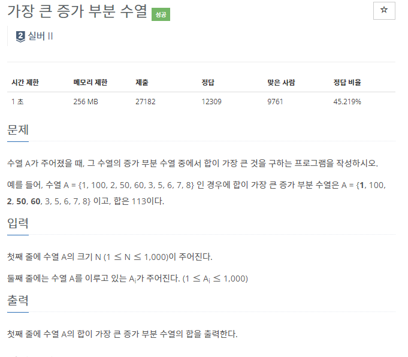
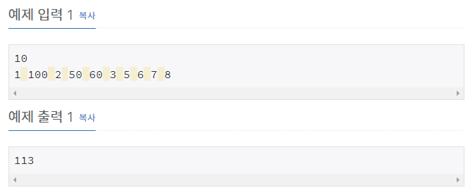

# [[11055] 가장 큰 증가 부분 수열](https://www.acmicpc.net/problem/11055)



___
## 🤔접근
1. <b>첫 번째 수부터 마지막 수까지 탐색하면서, 각각 첫 번째 수부터 현재 탐색하는 수(i번째)까지의 증가 부분 수열의 최대 합을 저장하고, 이 정보를 다음 수에서 이용하자.</b>
___
## 💡풀이
- <B>알고리즘 & 자료구조</B>
	- `DP`
- <b>구현</b>
	- Bottom-up
	- 점화식
		```c++
		for (int i = 0; i < N; i++) {
			dp[i] = seq[i]; // base condition
			for (int j = 0; j < i; j++) 
				if (seq[j] < seq[i]) 
					dp[i] = max(dp[i], dp[j] + seq[i]);
			ans = max(ans, dp[i]);
		}
		```
	- seq 배열에는 입력 수열을, dp 배열에는 `i번째까지의 증가 부분 수열의 최대 합`을 저장하였다.
	- 두 번째 반복문에서 첫 번째 수부터 i-1번째 수까지 탐색하면서, 아래의 두 가지 정보를 체크해야 한다.
		1. 현재 수(i번째)보다 작은 수인지?
			- `if (seq[j] < seq[i])`
		2. j번째 수까지의 증가 부분 수열의 최대 합에 현재 수를 더한 값이 최댓값인지?
			- `dp[i] = max(dp[i], dp[j] + seq[i])`
___
## ✍ 피드백
___
## 💻 핵심 코드
```c++
int main(){
	...

	vector<int> seq(N);
	vector<int> dp(N);
	for (int i = 0; i < N; i++)
		cin >> seq[i];

	int ans = 0;
	
	for (int i = 0; i < N; i++) {
		dp[i] = seq[i];
		for (int j = 0; j < i; j++) 
			if (seq[j] < seq[i]) 
				dp[i] = max(dp[i], dp[j] + seq[i]);
		ans = max(ans, dp[i]);
	}
	cout << ans;

	...
}
```