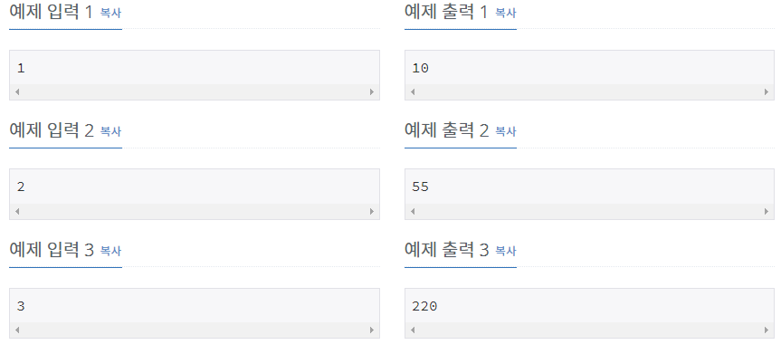

# [[11057] 오르막 수](https://www.acmicpc.net/problem/11057)



___
## 🤔접근
1. <b>숫자 i 앞에는 항상 1 ~ i인 숫자만 비내림차순으로 존재해야 한다.</b>
	- 길이가 j이고 맨 앞 숫자가 i일 때 경우의 수는, 길이가 j-1이고 맨 앞 숫자가 0 ~ i일 때의 경우의 수 합이다.
___
## 💡풀이
- <B>알고리즘 & 자료구조</B>
	- `DP`
- <b>구현</b>
	- Bottom-up 방식 구현
	- 점화식
		```c++
		for (int i = 2; i <= N; i++) 
			for (int j = 0; j <= 9; j++) 
				for (int k = 0; k <= j; k++) 
					dp[i][j] = (dp[i][j] + dp[i - 1][k]) % MOD;
		```
		- 기저 조건
		```c++
		for (int i = 0; i <= 9; i++)
			dp[1][i] = 1;
		```
	- 시간 복잡도: `O(N)`
___
## ✍ 피드백
___
## 💻 핵심 코드
```c++
int main(){
	...

	vector<vector<int>> dp(N + 1, vector<int>(10));
	for (int i = 0; i <= 9; i++)
		dp[1][i] = 1;
	
	for (int i = 2; i <= N; i++) 
		for (int j = 0; j <= 9; j++) 
			for (int k = 0; k <= j; k++) 
				dp[i][j] = (dp[i][j] + dp[i - 1][k]) % MOD;

	for (int i = 0; i <= 9; i++)
		ans = (ans + dp[N][i]) % MOD;

	cout << ans;
	...
}
```