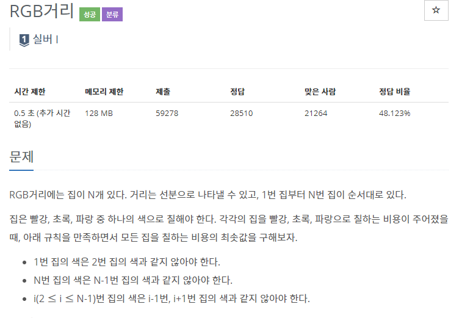
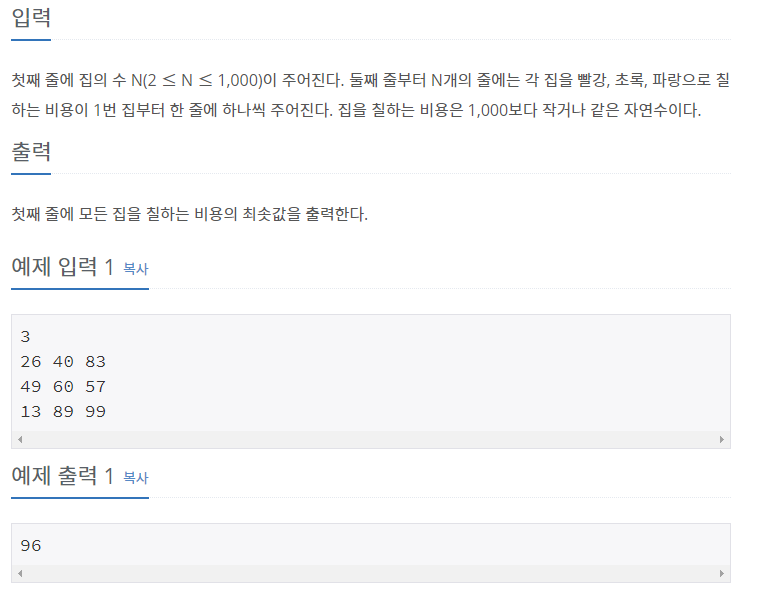

## [[1149] RGB거리](https://www.acmicpc.net/problem/1149)



___
## 💡풀이
- 동적계획법을 이용하였다.
- bottom-up 방식으로 구현하였다.
	- 옆 집과 색이 같으면 안되므로, 2번 집부터 N번 집까지 각 집에 각 페인트 비용에 현재 집과 겹치지 않는 이전 집에서의 두 페인트 비용의 minimum을 더해주는 방식으로 구현하였다.
```c++
// Bottom-up
   for (int i = 2; i <= N; i++) {
       R[i] += min(G[i - 1], B[i - 1]);
       G[i] += min(R[i - 1], B[i - 1]);
       B[i] += min(R[i - 1], G[i - 1]);
   }
   cout << min(R[N], min(G[N], B[N]));
```