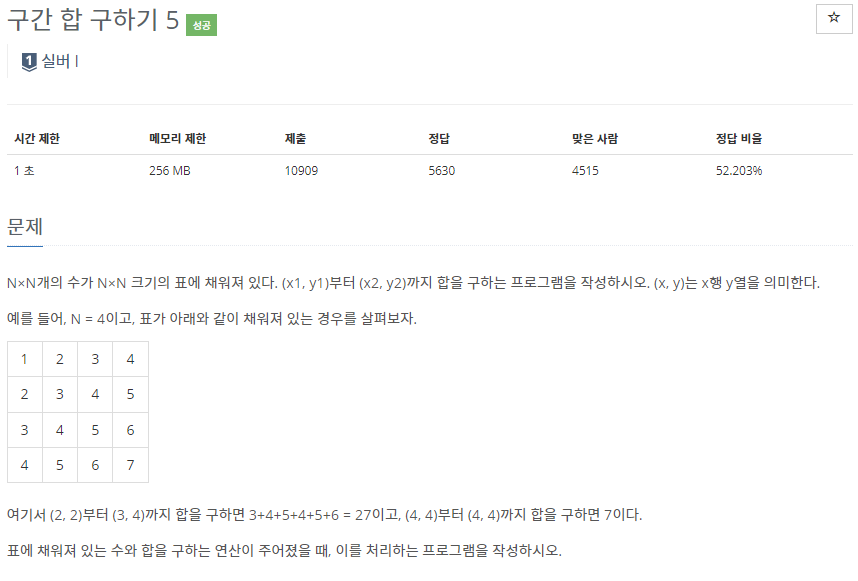
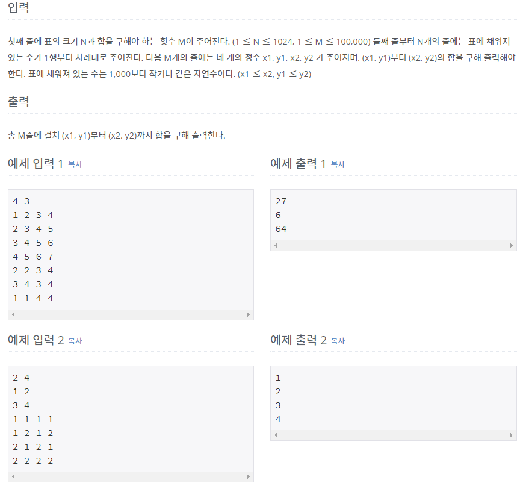
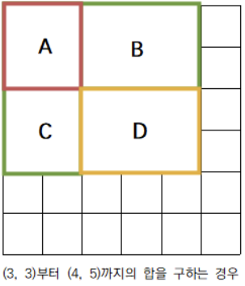

# [[11660] 구간 합 구하기 5](https://www.acmicpc.net/problem/11660)



___
## 🤔접근
1. <b>입력마다 일일이 구간 합을 구하는 것은 `O(N * M)`으로 비효율적이다.</b>
	- 미리 `누적 합`을 구해놓고(`O(N²)`), 구간 별로 뺄셈을 통해 `O(1)`에 구간 합을 구하자.
___
## 💡풀이
- <b>Bottom-up 동적계획법</b>을(를) 이용하였다.
	- 먼저 (0, 0)에서 (x, y)까지의 `누적 합`을 각각 구한다.<br><br>
	- 다음으로 `구간 합`을 구하는 방법을 알아보자.
	- 
	- 위 그림에서 `D{(3, 3) ~ (4, 5)}`를 구하는 방법은, `{(0, 0) ~ (4, 5)}`에서 `C{(0, 0) ~ (4, 2)}`와 `B{(0, 0) ~ (2, 5)}`를 빼고, 중복으로 제거된 `A{(0, 0) ~ (2, 2)}`를 다시 더함으로써 가능하다.
	- 따라서, `구간 합`을 구하는 식은 다음과 같다.
		- `sum[x2][y2] - sum[x2][y1 - 1] - sum[x1 - 1][y2] + sum[x1 - 1][y1 - 1]`
___
## ✍ 피드백
___
## 💻 핵심 코드
```c++
int n;
for (int i = 1; i <= N; i++) {
	for (int j = 1; j <= N; j++) {
		cin >> n;

		sum[i][j] = sum[i - 1][j] + sum[i][j - 1] - sum[i - 1][j - 1] + n;
	}
}

int x1, y1, x2, y2;
while (M--) {
	cin >> x1 >> y1 >> x2 >> y2;

	cout << sum[x2][y2] - sum[x2][y1 - 1] - sum[x1 - 1][y2] + sum[x1 - 1][y1 - 1] << '\n';
}
```