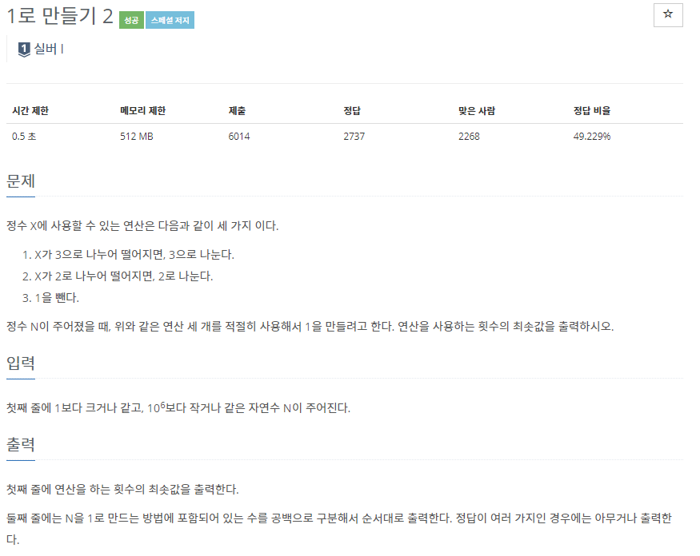
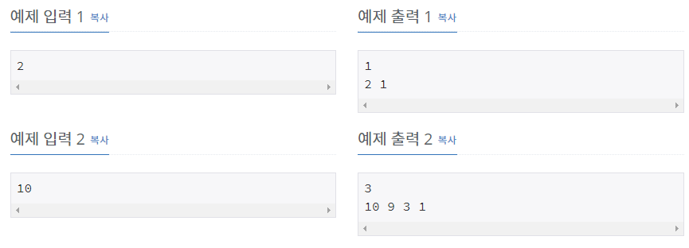

# [[12852] 1로 만들기 2](https://www.acmicpc.net/problem/12852)



___
## 🤔접근
1. <b>N을 1로 만들 수 있는 방법은 3가지로 주어졌다.</b>
	- BFS 또는 DP로 해결할 수 있다.
2. <b>추가로 N을 1로 만드는 방법에 포함되어 있는 수를 출력해야 한다.</b>
	- 현재 정수 X에서 다음 정수 Y로 갈 때, Y에 대해 이전 정수 값인 X를 저장하는 배열을 만들자.
___
## 💡풀이
- <b>Top-bottom 동적계획법 알고리즘</b>을(를) 사용하였다.
__
## ✍ 피드백
___
## 💻 핵심 코드
```c++
int DFS(int num) {
	if (num == 1)
		return 0;
	if (dp[num])
		return dp[num];

	int res[3] = {MAX, MAX, MAX};
	if (num % 3 == 0)
		res[0] = DFS(num / 3) + 1;
	if (num % 2 == 0)
		res[1] = DFS(num / 2) + 1;
	res[2] = DFS(num - 1) + 1;

	int minimum = min({res[0], res[1], res[2]});
	if (minimum == res[0])
		before[num] = num / 3;
	else if (minimum == res[1])
		before[num] = num / 2;
	else if (minimum == res[2])
		before[num] = num - 1;
	return dp[num] = minimum;
}
```