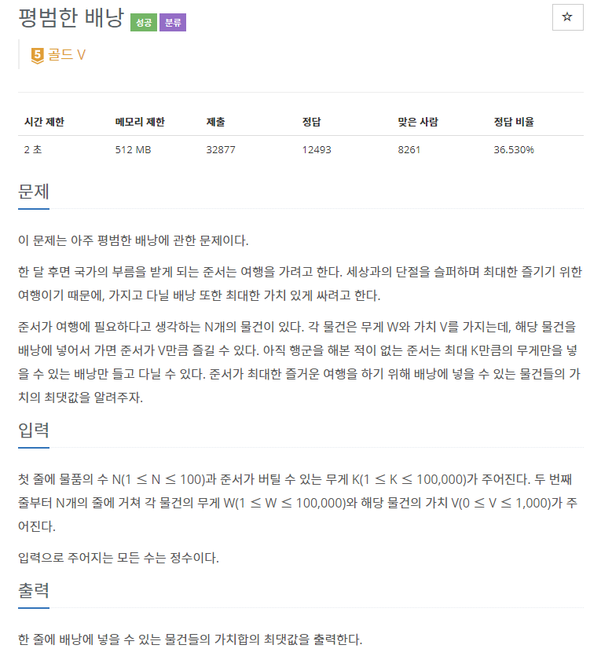
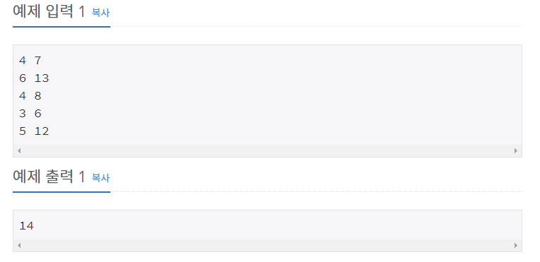

## [[12865] 평범한 배낭](https://www.acmicpc.net/problem/12865)



___
## 💡풀이
- 동적계획법을 이용하였다.
- Bottom-up 방식으로 구현하였다.
	- 첫 번째 물품부터 탐색하면서, 배낭의 최대 수용량을 1부터 K까지인 경우로 각각 나누었을 때, 각각 배낭에 넣을 수 있는 물건들의 가치합의 최대값을 dp에 저장한다.
    - `dp[i][j]`: 최대 수용 무게가 j이고, i번째 물품까지 탐색했을 때, 배낭에 넣을 수 있는 물건들의 가치합의 최댓값
    - `dp[i - 1][j]`: 최대 수용 무게가 j이고, i-1번째 물품까지 탐색했을 때, 배낭에 넣을 수 있는 물건들의 가치합의 최댓값
    - `dp[i - 1][j - weight[i]]`: 최대 수용 무게가 (j - 현재 물품의 무게)이고, i-1번째 물품까지 탐색했을 때, 배낭에 넣을 수 있는 물건들의 가치합의 최댓값
    - `value[i]`: i번째 물품의 가치
```c++
// Base condition : dp[0][j] = 0

// Bottom-up
for (int i = 1; i <= N; i++) {
	for (int j = 1; j <= K; j++) {
		// 최대 수용 무게가 j일 때, 현재 물품을 배낭에 넣으면 j를 초과하지 않는가?
		if (j - weight[i] >= 0)
			dp[i][j] = max(dp[i - 1][j], (dp[i - 1][j - weight[i]] + value[i]));
		else
			dp[i][j] = dp[i - 1][j];
	}
}

	cout << dp[N][K];
```