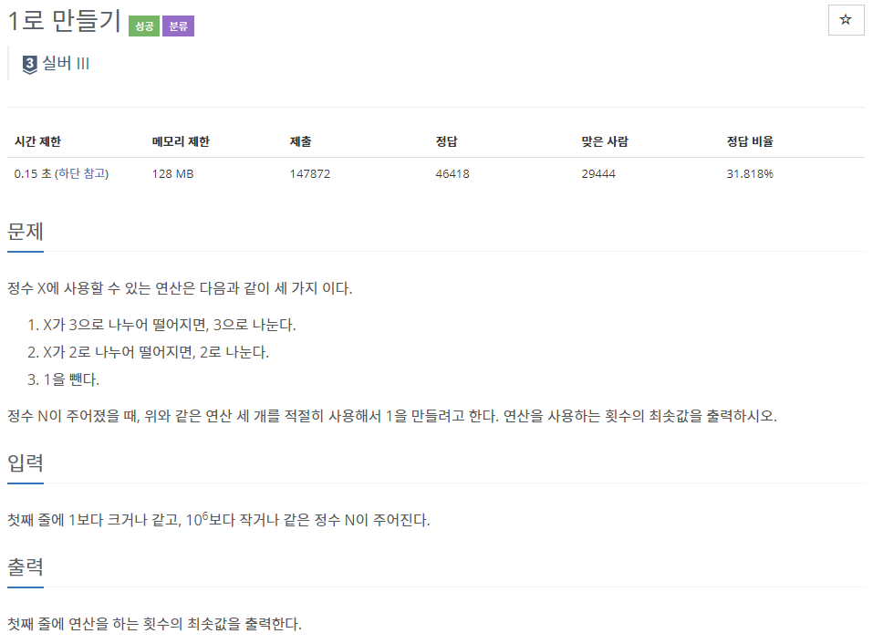
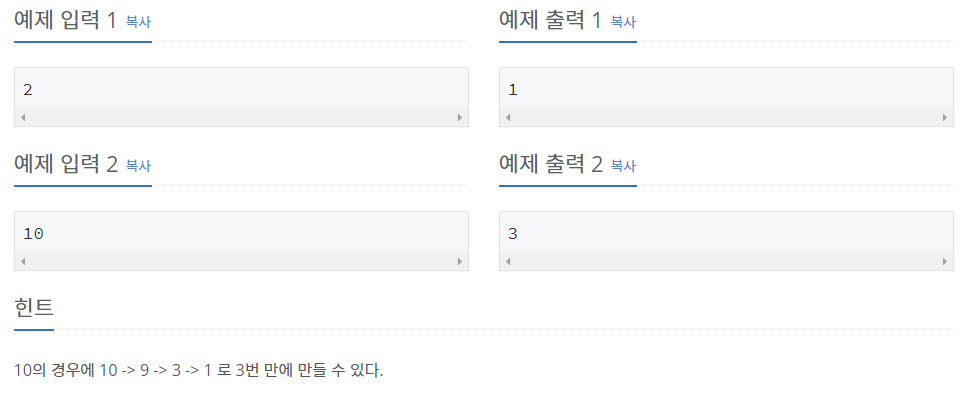

## [[1463] 1로 만들기](https://www.acmicpc.net/problem/1463)



___
## 💡풀이
- 동적계획법을 이용하였다.
- Top-down 방식으로 구현하였다.
	- 주어진 3 가지 경우를 재귀호출하여 구현하되, 3 가지 경우 중 min값을 캐시에 저장하여 메모이제이션 하도록 구현한다.
	- top-down 방식의 기저조건은 종료조건에 해당하며, num이 1이되는 경우가 기저이므로, 0을 반환한다.
```c++
int f(int num) {
    int r1 = INT_MAX, r2 = INT_MAX, r3 = INT_MAX;
    
    // Base condition
    if (num == 1)
        return 0;
    // Memoization
    if (dp[num] != 0)
        return dp[num];

    // Top-down
    if (num % 3 == 0)
        r1 = f(num / 3) + 1;
    if (num % 2 == 0)
        r2 = f(num / 2) + 1;
    r3 = f(num - 1) + 1;

    return dp[num] = min({r1,r2,r3});
}
```