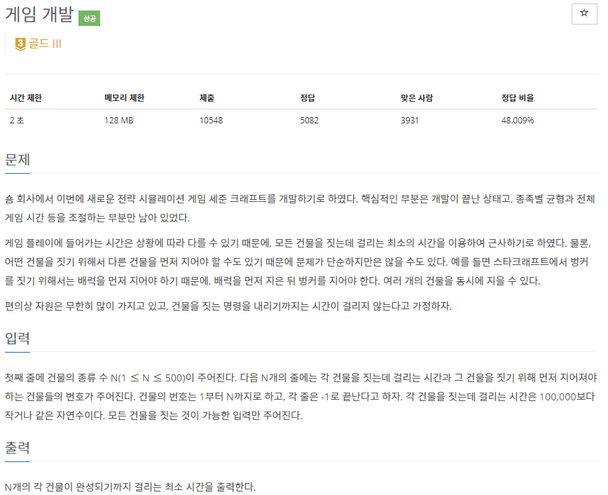
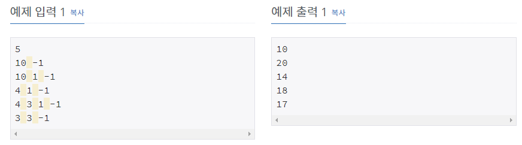

# [[1516] 게임 개발](https://www.acmicpc.net/problem/1516)



___
## 🤔접근
1. <b>위상 정렬을 잘 이용하면, 각 건물을 순서대로 건설할 수 있으므로 최소 시간으로 건물을 완성시킬 수 있다.</b>
2. <b>동적 계획법을 이용하여, 이전 건물까지 소요되는 최소 시간 정보를 이용하여 현재 건물까지 소요되는 시간을 구하자.</b>
___
## 💡풀이
- <B>알고리즘 & 자료구조</B>
	- `Topological Sort`
	- `DP`
- <b>구현</b>
	- 위상 정렬 알고리즘에 동적 계획법을 응용하여 해결하였다.
		- `현재 건물이 완성되기까지 걸리는 최소 시간`보다 (`이전 건물이 완성되기까지 걸리는 최소 시간` + `현재 건물을 짓는데 걸리는 시간`)이 크다면, 갱신해주었다.
		- 점화식
			- `result[next] = max(result[next], result[cur] + time[next])`
___
## ✍ 피드백
___
## 💻 핵심 코드
```c++
bool topologicalSort(const vector<vector<int>>& adj, vector<int>& inDegree, const int& N, vector<int>& result) {
    queue<int> q;
    vector<int> time(N + 1);

    for (int i = 1; i <= N; i++) {
        if (inDegree[i] == 0)
            q.push(i);
        time[i] = result[i];
    }

    for (int u = 1; u <= N; u++) {
        if (q.empty())
            return false;

        int cur = q.front();
        q.pop();
 
        for (int next : adj[cur]) {
            if (--inDegree[next] == 0) 
                q.push(next);
            result[next] = max(result[next], result[cur] + time[next]);
        }
    }

    return true;
}
```