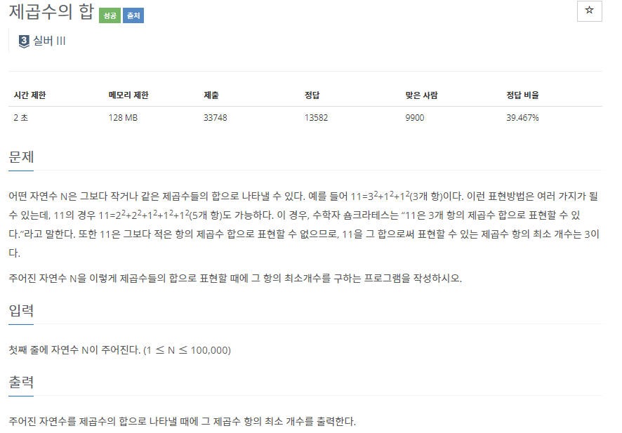

# [[1699] 제곱수의 합](https://www.acmicpc.net/problem/1699)



___
## 🤔접근
1. <b>{1², 2², ..., N보다 작은 제곱수} 숫자들을 이용하여 N을 만들 수 있는 최소 개수를 구하자.</b>
	- 1부터 N까지의 각 숫자 i마다, {1², ... i보다 작은 제곱수}를 이용하여 i를 만들 수 있는 최소 개수를 구하고, 이 정보를 큰 수(i + 제곱수)에서 이용하자.
	- i에 {1², ... i보다 작은 제곱수}를 하나씩 뺀 수를 다시 제곱수들의 합으로 나타날 때의 항의 최소 개수에 1을 더하면 `i를 만드는 항의 최소 개수`가 된다.
	- 예를들어 i가 32이라면,
		- `dp[32-1²], dp[32-2²], dp[32-3²], dp[32-4²], dp[32-5²]` 중에서 최솟값에 1을 더하면 항의 최소 개수가 된다.
___
## 💡풀이
- <B>알고리즘 & 자료구조</B>
	- `DP`
- <b>구현</b>
	- 점화식
		```c++
		for (int i = 1; i <= N; i++)
			for (int j = 1; j * j <= i; j++)
				dp[i] = min(dp[i], dp[i - j * j] + 1);
		```
	- 기저 조건
		- 모든 수들을 1²의 합으로 나타내는 방법(가장 최대 개수)으로 초기화
		```c++
		for (int i = 1; i <= N; i++)
			dp[i] = i;
		```
___
## ✍ 피드백
___
## 💻 핵심 코드
```c++
int main(){
	...

	vector<int> dp(N + 1);
	for (int i = 1; i <= N; i++)
		dp[i] = i;

	for (int i = 1; i <= N; i++)
		for (int j = 1; j * j <= i; j++)
			dp[i] = min(dp[i], dp[i - j * j] + 1);

	cout << dp[N];

	...
}
```