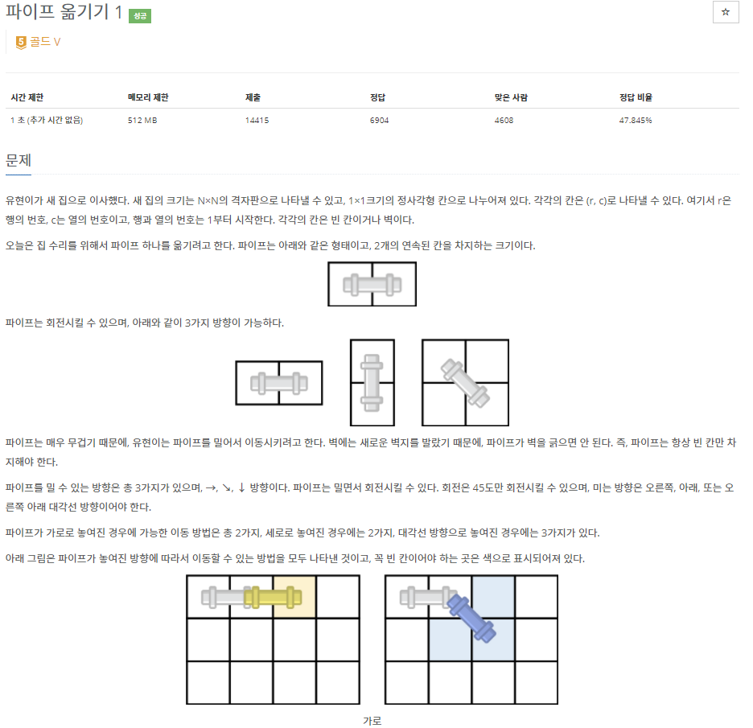
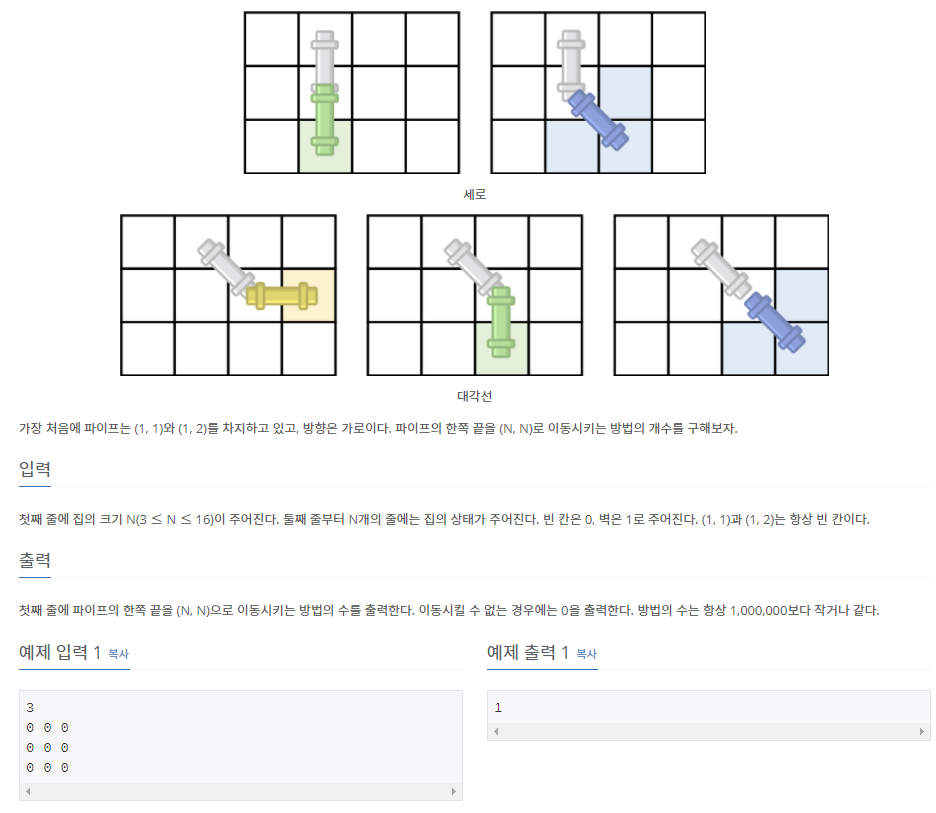
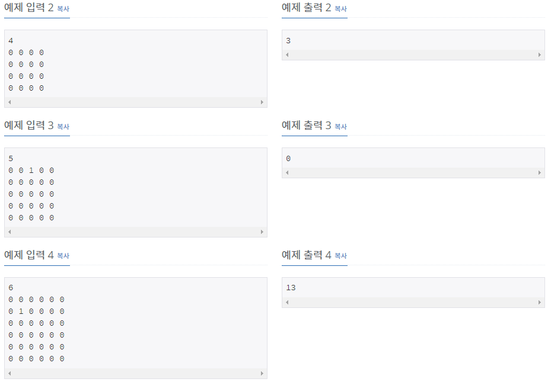

# [[17070] 파이프 옮기기 1](https://www.acmicpc.net/problem/17070)




___
## 🤔접근
1. <b>시작점 -> 도착점으로 가는 경우의 수를 구하는 문제이다.</b>
	- 동적계획법을 이용하여 각 위치마다 시작점으로부터 도달할 수 있는 경우의 수를 저장하자.
	- 상태에 따라 이동할 수 있는 경우의 수가 다르다.
		- 현재 상태가 `가로`인 경우: 가로, 대각선으로 이동 가능
		- 현재 상태가 `세로`인 경우: 세로, 대각선으로 이동 가능
		- 현재 상태가 `대각선`인 경우: 가로, 세로, 대각선으로 이동 가능
___
## 💡풀이
- <b>Bottom-up 동적계획법(Dynamic Programming) 알고리즘</b>을(를) 사용하였다.
	- 파이프의 꼬리부분을 현재 위치로 잡고, 상태를 이용하여 머리부분이 가로, 세로, 대각선 중 어디에 있는지를 구분하였다.
		- dp[row][column][state]
			- state: `HORIZONTAL`, `VERTICAL`, `DIAGONAL`
		- 인덱스 범위를 벗어나거나, 벽에 닿는 경우를 제외하고, 파이프를 옮겨야 한다.
		- 기저 조건으로는 `(1, 1) 가로`: 경우의 수 1가지으로 시작하였다.
		- 현재 위치에서 가로, 세로, 대각선 상태의 경우의 수를 각 상태에서 이동 가능한 위치의 dp에 더하였다.
___
## ✍ 피드백
___
## 💻 핵심 코드
```c++
dp[1][1][HORIZONTAL] = 1; // base condition

for (int i = 1; i <= N; i++) {
	for (int j = 1; j <= N; j++) {

		if (j + 1 <= N && blank[i][j + 1]) { // 현재 상태: 가로
			if (j + 2 <= N && blank[i][j + 2]) {
				dp[i][j + 1][HORIZONTAL] += dp[i][j][HORIZONTAL];
				if (i + 1 <= N && blank[i + 1][j + 2] && blank[i + 1][j + 1])
					dp[i][j + 1][DIAGONAL] += dp[i][j][HORIZONTAL];
			}
		}

		if (i + 1 <= N && blank[i + 1][j]) { // 현재 상태: 세로
			if (i + 2 <= N && blank[i + 2][j]) {
				dp[i + 1][j][VERTICAL] += dp[i][j][VERTICAL];
				if (j + 1 <= N && blank[i + 2][j + 1] && blank[i + 1][j + 1])
					dp[i + 1][j][DIAGONAL] += dp[i][j][VERTICAL];
			}
		}

		if (i + 1 <= N && j + 1 <= N && blank[i + 1][j + 1]) { // 현재 상태: 대각선
			if (j + 2 <= N && blank[i + 1][j + 2])
				dp[i + 1][j + 1][HORIZONTAL] += dp[i][j][DIAGONAL];
			if (i + 2 <= N && blank[i + 2][j + 1])
				dp[i + 1][j + 1][VERTICAL] += dp[i][j][DIAGONAL];
			if (i + 2 <= N && j + 2 <= N && blank[i + 1][j + 2] && blank[i + 2]j + 1] && blank[i + 2][j + 2])
				dp[i + 1][j + 1][DIAGONAL] += dp[i][j][DIAGONAL];
		}
	}
}

cout << dp[N - 1][N - 1][DIAGONAL] + dp[N - 1][N][VERTICAL] + dp[N][N - 1][HORIZONTAL];
```