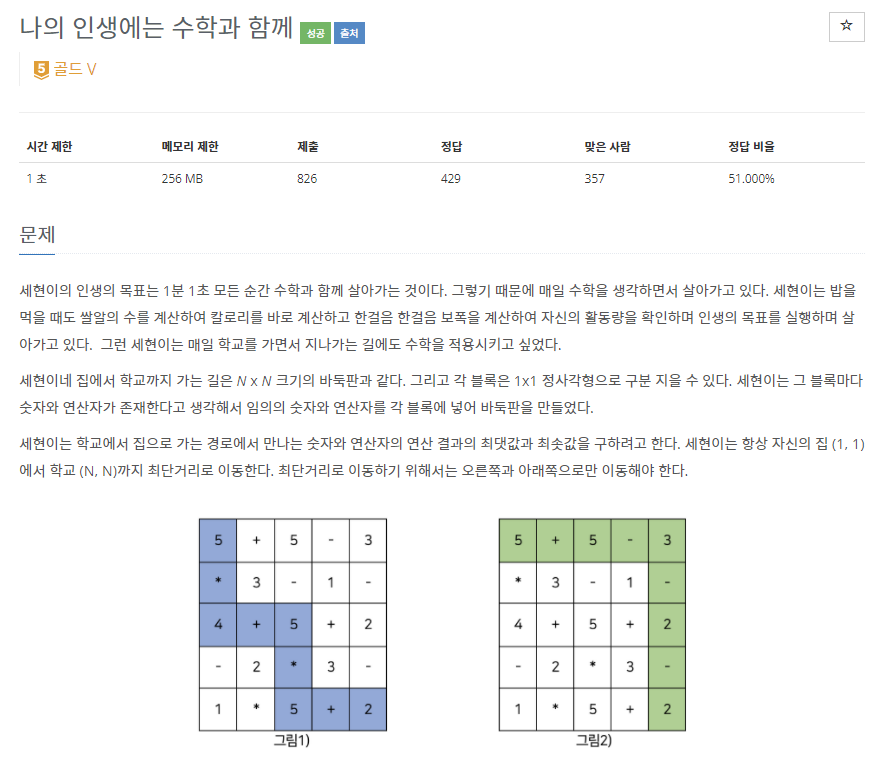
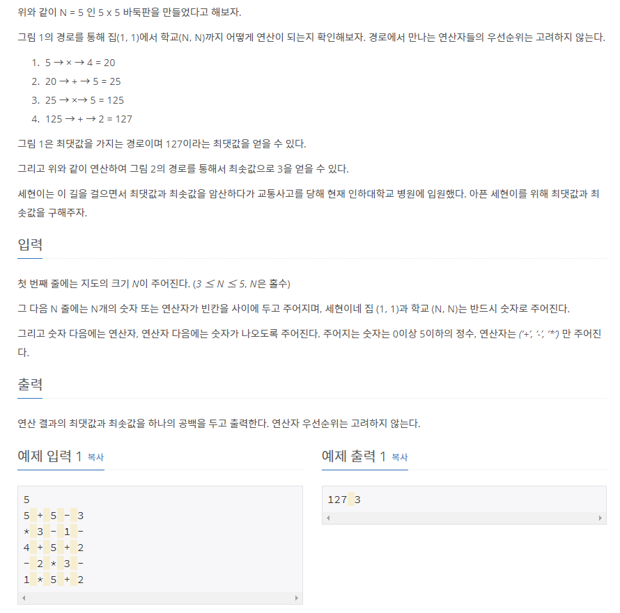

# [[17265] 나의 인생에는 수학과 함께](https://www.acmicpc.net/problem/17265)



___
## 🤔접근
- 시작점(0, 0)에서 도착점(N - 1, N - 1)까지 최단거리로 이동하되, 이동하면서 연산을 수행한 값이 각각 최댓값, 최솟값이 되는 값을 구해야 한다.
	- DFS으로 탐색하되, 불필요한 탐색을 피하기 위해 동적계획법을 이용하여 각 경로까지의 연산의 최댓값, 최솟값을 유지하자.
	- 최단거리로 탐색해야 하므로, 오른쪽과 아래로만 이동해야 한다.
___
## 💡풀이
- <b>알고리즘 & 자료구조</b>
	- `DFS`
	- `DP`
- <b>구현</b>
	- 현재 위치가 숫자인 경우와 연산자인 경우로 나누어서 구현하였다.
		- <b>현재 위치가 연산자</b>
			- 이전 위치의 숫자와 다음 탐색할 숫자를 연산한 결과를 구한다.
			- 연산 결과가 현재 위치의 dp와 비교하여, 최댓값, 최솟값에 따라 적절히 갱신하고 다음 위치로 탐색한다.
		- <b>현재 위치가 숫자</b>
			- 오른쪽과 아래로 각각 이동 탐색한다.
___
## ✍ 피드백
___
## 💻 핵심 코드
```c++
void DFS(int row, int col, int val, int type) {
    if (row == N - 1 && col == N - 1) {
        if (type == MIN) 
            minVal = min(minVal, val);
        else if (type == MAX) 
            maxVal = max(maxVal, val);
        return;
    }

    // 현재 위치가 연산자인 경우
    char oper = v[row][col];
    if (oper == '+' || oper == '-' || oper == '*') {
        for (int i = 0; i < 2; i++) {
            int nextRow = row + dr[i];
            int nextCol = col + dc[i];

            if (nextRow < 0 || nextCol < 0 || nextRow >= N || nextCol >= N)
                continue;

            int result;
            int firstVal = val;
            int secondVal = v[nextRow][nextCol] - '0';

            if (oper == '+') 
                result = firstVal + secondVal;
            else if (oper == '-') 
                result = firstVal - secondVal;
            else if (oper == '*') 
                result = firstVal * secondVal;

            if (type == MAX) {
                if (result > dp[nextRow][nextCol]) {
                    dp[nextRow][nextCol] = result;
                    DFS(nextRow, nextCol, result, type);
                }
            }
            else if (type == MIN) {
                if (result < dp[nextRow][nextCol]) {
                    dp[nextRow][nextCol] = result;
                    DFS(nextRow, nextCol, result, type);
                }
            }
        }
    }

    // 현재 위치가 숫자인 경우
    else {
        for (int i = 0; i < 2; i++) {
            int nextRow = row + dr[i];
            int nextCol = col + dc[i];

            if (nextRow < 0 || nextCol < 0 || nextRow >= N || nextCol >= N)
                continue;
            
            DFS(nextRow, nextCol, val, type);
        }
    }
}
```