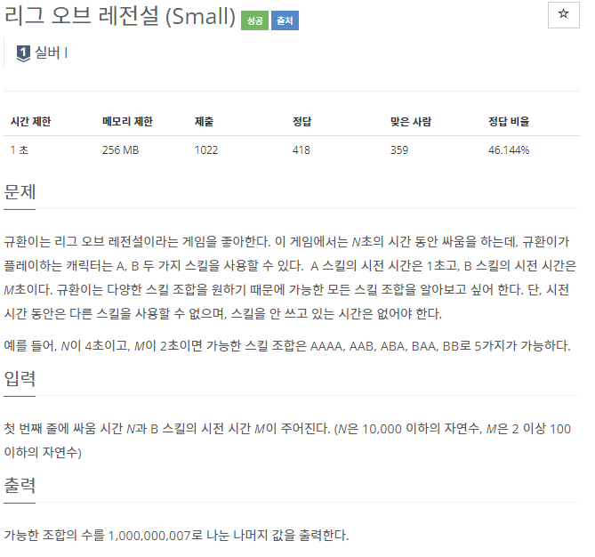
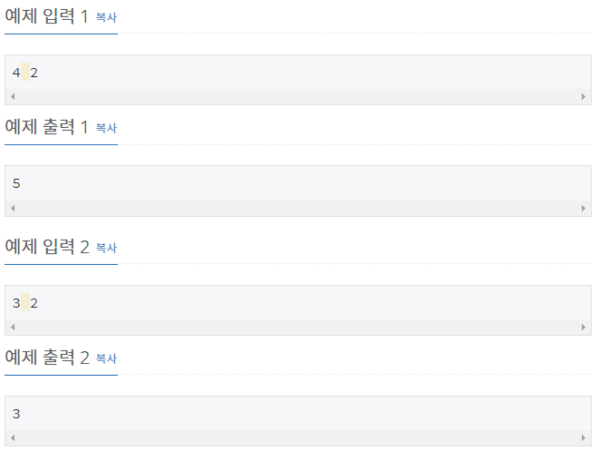

## [[17271] 리그 오브 레전설 (Small)](https://www.acmicpc.net/problem/17271)



___
## 🤔접근
- A는 시전시간이 1초이고, B는 M초이므로, 1 ~ M - 1초 사이에 각각 시전이 끝났을 때의 경우의 수는 항상 1가지이다.
    - M초에는 B가 시전이 끝났거나, A가 끝났을 수 있으므로 2가지이다.
    - M + 1초 부터는, 직전에 어떤 스킬을 사용했는지에 따라 경우의 수가 나뉘어질 수 있다.
        - 직전에 A를 시전했거나, M초 전에 B를 시전한 경우를 모두 더한 값이 M + 1초에 대한 경우의 수이다.
___
## 💡풀이
- <b>알고리즘 & 자료구조</b>
    - `DP`
- <b>구현</b>
    - <b>점화식</b>
        ```c++
    	for (int i = M + 1; i <= N; i++)
	    	dp[i] = (dp[i - 1] + dp[i - M]) % MOD;
        ```
    - <b>초기값</b>
        - `dp[0] ~ dp[M - 1] = 1`
        - `dp[M] = 2`
___
## ✍피드백
___
## 💻핵심 코드
```c++
int main(){
    ...
	vector<long long> dp(10001);
	fill(dp.begin(), dp.begin() + M, 1);
	dp[M] = 2;

	for (int i = M + 1; i <= N; i++)
		dp[i] = (dp[i - 1] + dp[i - M]) % MOD;

	cout << dp[N];
    ...
}
```