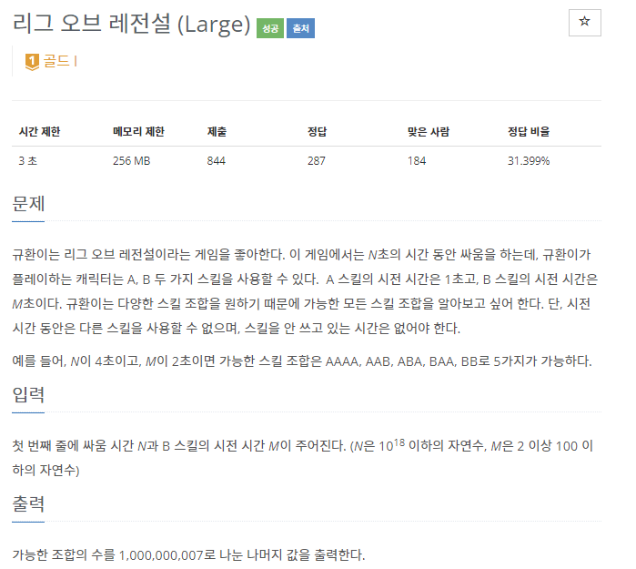
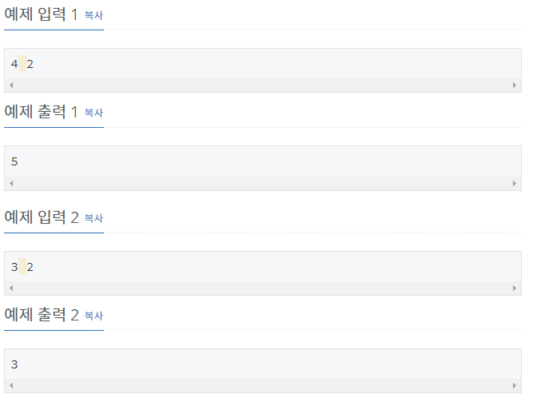
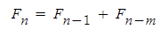
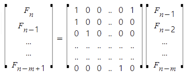
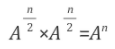

## [[17272] 리그 오브 레전설 (Large))](https://www.acmicpc.net/problem/17272)



___
## 🤔접근
- A는 시전시간이 1초이고, B는 M초이므로, 1 ~ M - 1초 사이에 각각 시전이 끝났을 때의 경우의 수는 항상 1가지이다.
    - M초에는 B가 시전이 끝났거나, A가 끝났을 수 있으므로 2가지이다.
    - M + 1초 부터는, 직전에 어떤 스킬을 사용했는지에 따라 경우의 수가 나뉘어질 수 있다.
        - 직전에 A를 시전했거나, M초 전에 B를 시전한 경우를 모두 더한 값이 M + 1초에 대한 경우의 수이다.
- N이 10¹⁸으로 매우 큰 수 이므로, 최소 `로그 시간 이내`로 답을 구할 수 있는 알고리즘이 필요.
    - 점화식이 `1차식`이면 `행렬로 표현`하여 `거듭 제곱을 이용한 분할 정복`이 가능함.
___
## 💡풀이
- <b>알고리즘 & 자료구조</b>
    - `DP`
    - `분할 정복`
- <b>구현</b>
    - <b>점화식</b><br>
        
    - <b>행렬의 거듭 제곱을 이용한 분할 정복</b><br>
        <br>
        - 행렬의 첫 행에는 점화식을 만족하도록 계수를 설정하고, 나머지 행에는 자기 자신이 나오도록 계수를 설정한다.
        - 이를 거듭제곱하고, 최종적으로 0행 0열의 값이 답이 된다.
        - 아래의 거듭 제곱 성질을 이용하여 `O(M³log₂N)`에 답을 구할 수 있다.<br>
            
___
## ✍피드백
___
## 💻핵심 코드
```c++
typedef vector<vector<long long>> matrix;
matrix operator* (const matrix& a, const matrix& b) {
	int n = a.size();
	matrix result(n, vector<long long>(n));

	for (int i = 0; i < n; i++)
		for (int j = 0; j < n; j++)
			for (int k = 0; k < n; k++)
				result[i][j] = (result[i][j] + a[i][k] * b[k][j]) % MOD;

	return result;
}

int main(){
    ...
	// 행렬 계수
	matrix m(M, vector<long long>(M));
	m[0][0] = m[0][M - 1] = 1;
	for (int i = 1; i < M; i++)
		m[i][i - 1] = 1;

	// 단위 행렬로 초기화
	matrix ans(M, vector<long long>(M));
	for (int i = 0; i < M; i++)
		ans[i][i] = 1;

	// 분할 정복
	while (N) {
		if (N & 1)
			ans = ans * m;
		m = m * m;
		N /= 2;
	}

	cout << ans[0][0];
    ...
}
```