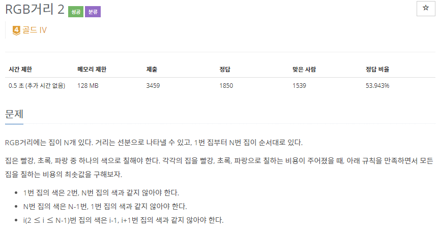
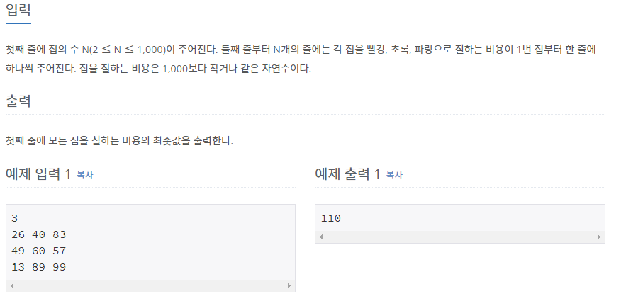

# [[17404] RGB거리 2](https://www.acmicpc.net/problem/17404)



___
## 🤔접근
1. <b>규칙을 만족하면서 모든 집을 칠하는 경우의 수를 모두 따져보려면 시간복잡도가 `O(2ⁿ)`이다.</b>
	- 작은 문제로 큰 문제를 해결하는 DP를 이용하여 시간복잡도를 개선하자.
2. <b>마지막 집을 칠할 때, 첫 번째 집의 색과 일치하지 않아야 한다.</b>
	- 그러므로 마지막 집을 칠할 때, 첫 번째 집의 색이 무엇이었는지 알고 있어야 한다.
___
## 💡풀이
- <b>Bottom-up 동적 계획법</b>을 이용하였다.
	- `dp[n][color]`: (n 번째 집을 color로 칠했을 때의 비용) + (n-1 번째까지 조건에 맞게 칠한 최소 비용)
		- `Base condition`: 첫 번째 집의 색을 정해 놓고 시작
		- `Memoization`: 현재 집까지 칠한 최소비용을 캐시에 저장하여, 다음 집을 칠하는 작업에서 재활용
		- `Recurrence relation`
			```c++
			dp[i][0] = min(dp[i - 1][1], dp[i - 1][2]) + costs[i][0];
			dp[i][1] = min(dp[i - 1][0], dp[i - 1][2]) + costs[i][1];
			dp[i][2] = min(dp[i - 1][1], dp[i - 1][0]) + costs[i][2];
			```
	
___
## ✍ 피드백
- 동적계획법을 이용하여 마지막 집과 첫 번째 집을 다른 색으로 칠하기 위해서는 마지막에 첫 번째 집의 색이 무슨 색인지 알고 있어야 한다.
	- 이를 반대로 생각하면, 미리 첫 번째 집의 색을 정해놓고 시작해도 된다!
___
## 💻 핵심 코드
```c++
for (int color = 0; color < NCOLOR; color++) {
	// 첫 번째 집의 색을 정해 놓고 시작
	for (int i = 0; i < NCOLOR; i++) {
		if (i == color)
			dp[1][i] = costs[1][i];
		else
			dp[1][i] = MAX;
	}

	// 두 번째 집 ~ N 번째 집 칠하기
	for (int i = 2; i <= N; i++) {
		dp[i][0] = min(dp[i - 1][1], dp[i - 1][2]) + costs[i][0];
		dp[i][1] = min(dp[i - 1][0], dp[i - 1][2]) + costs[i][1];
		dp[i][2] = min(dp[i - 1][1], dp[i - 1][0]) + costs[i][2];
	}

	// 첫 번째 집의 색을 고려하여 마지막 집 칠하기
	for (int i = 0; i < NCOLOR; i++)
		if (i != color) 
			answer = min(answer, dp[N][i]);
}
```