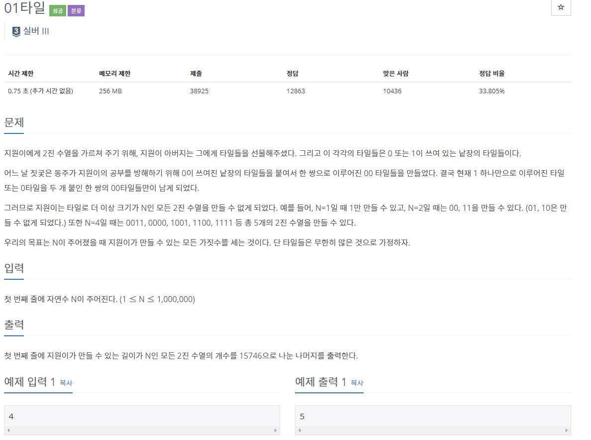

## [[1904] 01타일](https://www.acmicpc.net/problem/1904)


___
## 💡풀이
- 동적계획법을 이용하였다.
- bottom-up 방식으로 구현하였다.
	- 점화식 : `dp[i] = dp[i - 1] + dp[i - 2]`
	- 기저조건 : `dp[1] = 1`, `dp[2] = 2`
```c++
dp[1] = 1;
dp[2] = 2;
for (int i = 3; i <= N; i++) 
    dp[i] = (dp[i - 1] + dp[i - 2]) % 15746;
cout << dp[N];
```