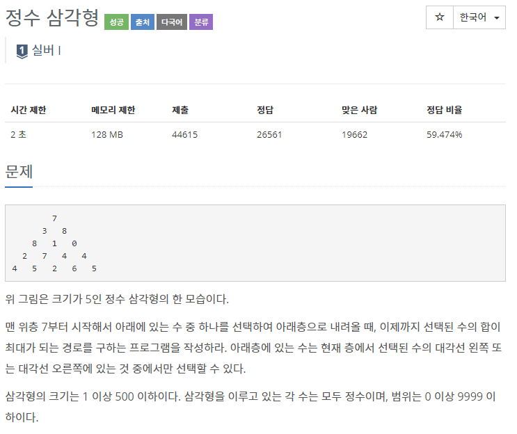
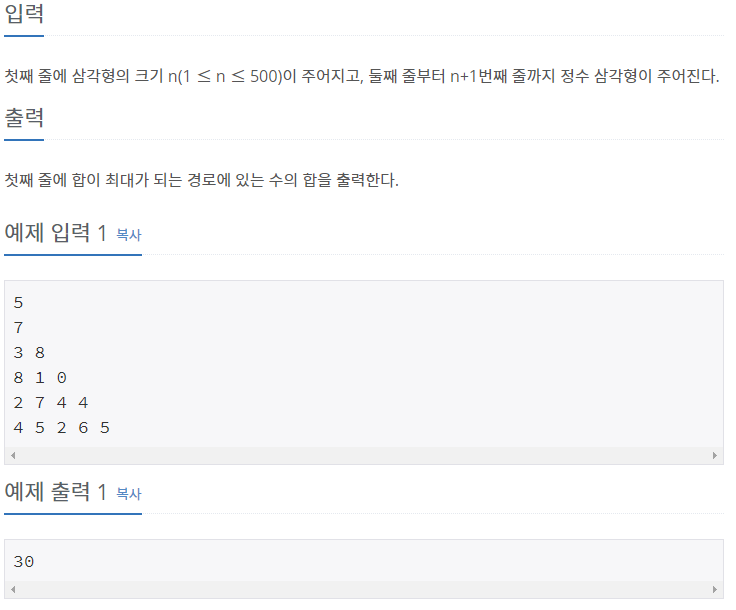

## [[1932] 정수 삼각형](https://www.acmicpc.net/problem/1932)



___
## 💡풀이
- 동적계획법을 이용하였다.
- bottom-up 방식으로 구현하였다.
	- 맨 마지막 층부터 시작하여, max(i, i+1)를 윗층의 i번 째 수에 더해주는 과정을 1층까지 반복한다.
	- 점화식 : `dp[i - 1][j] += max(dp[i][j], dp[i][j + 1])`
```c++
// Bottom-up
for (int i = N; i > 1; i--) 
    for (int j = 0; j < N - 1; j++) 
        dp[i - 1][j] += max(dp[i][j], dp[i][j + 1]);
```