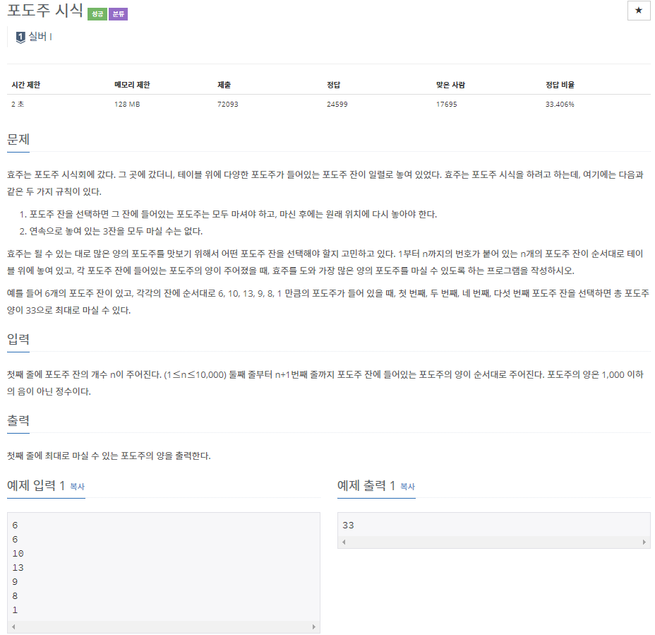

## [[2156] 포도주 시식](https://www.acmicpc.net/problem/2156)


___
## 💡풀이
- 동적계획법을 이용하였다.
- Bottom-up 방식으로 구현하였다.
	- 연속으로 3잔 마시는 것이 불가능 하므로, 다음의 세 가지 경우만을 따져 보면 된다.
		1. 연속 `0회` 시식 : 이번 차례(i)에 포도주를 마시지 않은 경우
		2. 연속 `1회` 시식 : 직전 차례(i - 1)에 포도주를 마시지 않고, 이번 차례(i)에 포도주를 마시는 경우
		3. 연속 `2회` 시식 : 직전(i - 1), 이번 차례(i)에 포도주를 마시고, 그 전(i - 2)에는 포도주를 마시지 않은 경우
	- dp 배열에는 현재 시점(i)에서 포도주를 최대로 시식했을 때의 양을 저장한다.
```c++
   // Base condition
   dp[1] = table[1];
   if (n > 1)
       dp[2] = table[1] + table[2];

   // Bottom-up
   for (int i = 3; i <= n; i++) 
       dp[i] = max(dp[i - 1], max(dp[i - 2] + table[i], dp[i - 3] + table[i - 1] + table[i]));
   
   cout << dp[n];
```