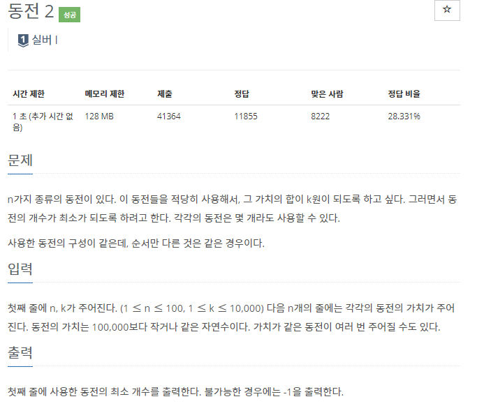
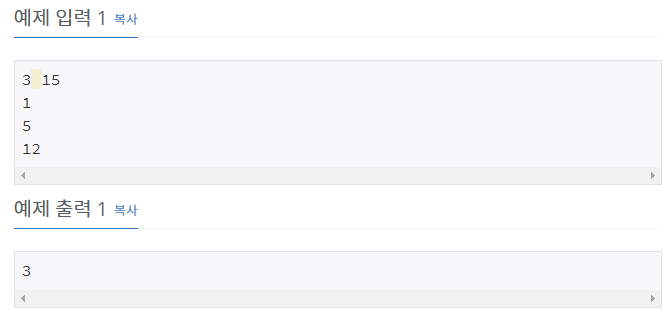

# [[2294] 동전 2](https://www.acmicpc.net/problem/2294)



___
## 🤔접근
1. <b>먼저, 작은 동전부터 사용하여 만들 수 있는 동전들에 사용된 동전 개수를 저장하자.</b>
	- 입력된 동전을 오름차순으로 정렬
		```c++
		sort(coin.begin(), coin.end())
		```
	- 작은 동전부터 하나씩 탐색하면서, 해당 동전(`coin[i]`)부터 k까지 만드려는 동전(`j`)을 1씩 증가시키면서 아래의 작업을 수행한다.
		- j - coin[i]을 만들 수 있는 경우, `현재 j를 만들 수 있는 경우`와 `j - coin[i]을 만들 수 있는 경우 + 1`를 비교하여 최솟값을 저장한다.
___
## 💡풀이
- <B>알고리즘 & 자료구조</B>
	- `DP`
- <b>구현</b>
	- Bottom-up
	- 점화식
		```c++
		for (int i = 0; i < n; i++) {
			for (int j = coin[i]; j <= k; j++) {
				if (dp[j - coin[i]] != NONE) {
					if (dp[j] == NONE)
						dp[j] = dp[j - coin[i]] + 1;
					else
						dp[j] = min(dp[j], dp[j - coin[i]] + 1);
				}
			}
		}
		```
	- 기저 조건
		```c++
		vector<int> dp(k + 1, NONE); // 처음엔 모두 만들 수 없는 경우로 초기화
		for (int i = 0; i < n; i++) {
			cin >> coin[i];
			dp[coin[i]] = 1; // 입력받은 동전은 바로 만들 수 있으므로 1로 초기화
		}
		dp[0] = 1; // 동전이 0원인 경우는 항상 1가지이므로 1으로 초기화
		```
___
## ✍ 피드백
___
## 💻 핵심 코드
```c++
int main(){
	...

	vector<int> seq(N);
	vector<int> dp(N);
	for (int i = 0; i < N; i++)
		cin >> seq[i];

	int ans = 0;
	
	for (int i = 0; i < N; i++) {
		dp[i] = seq[i];
		for (int j = 0; j < i; j++) 
			if (seq[j] < seq[i]) 
				dp[i] = max(dp[i], dp[j] + seq[i]);
		ans = max(ans, dp[i]);
	}
	cout << ans;

	...
}
```