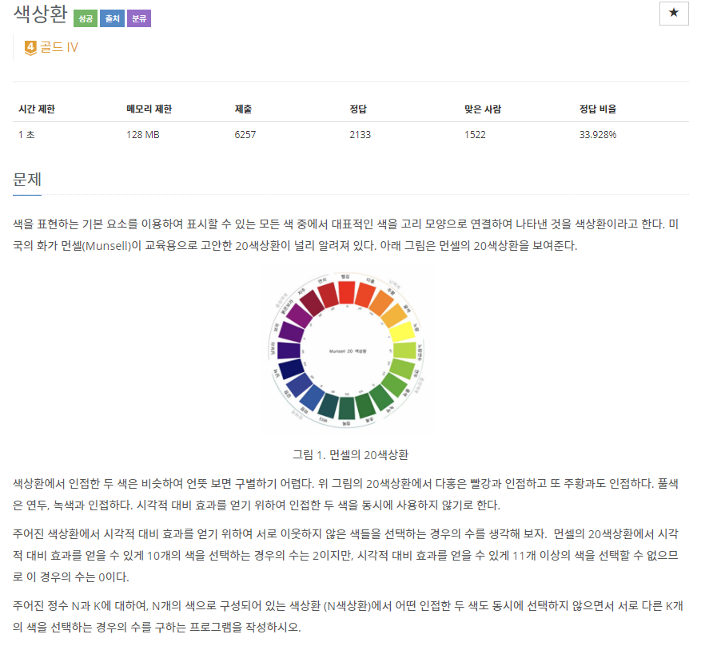
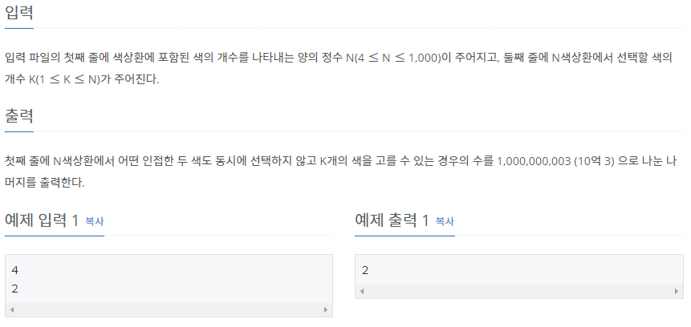

# [[2482] 색상환](https://www.acmicpc.net/problem/2482)



___
## 🤔접근
1. <b>n개중 k개를 순서에 상관없이 뽑는 경우의 수(조합) : nCk = n! / ((n-r)! * r!)</b>
	- 작은 문제로 큰 문제를 해결하는 DP를 이용하여 시간복잡도를 개선하자.
2. <b>색은 원형으로 배치되어 있다.</b>
	- 마지막 색을 선택할 때, 첫 번째 색의 선택 유무에 주의해야 한다.
___
## 💡풀이
- <b>Bottom-up 동적 계획법</b>을 이용하였다.
	- `dp[n][k]`: n개 색 중에서 k개를 인접하지 않게 선택하는 경우의 수
		- `Base condition`
			```c++
			dp[i][1] = i
			```
			- i개 색 중에서 1개를 인접하지 않게 선택하는 경우의 수는 당연히 i이다.
		- `Recurrence relation`
			```c++
			dp[i][j] = (dp[i - 2][j - 1] + dp[i - 1][j]) % MOD
			```
			- `dp[i - 2][j - 1]`: i 번째 색을 선택하는 경우, i-2번째까지 j-1개를 선택하는 경우의 수
			- `dp[i - 1][j]`: i 번째 색을 선택하지 않는 경우, i-1번째까지 j개를 선택하는 경우의 수
	
___
## ✍ 피드백
___
## 💻 핵심 코드
```c++
for (int i = 1; i <= N; i++) {
	dp[i][1] = i; // base condition
	
	for (int j = 2; j <= i / 2; j++)
		dp[i][j] = (dp[i - 2][j - 1] + dp[i - 1][j]) % MOD;
}

cout << dp[N][K];
```