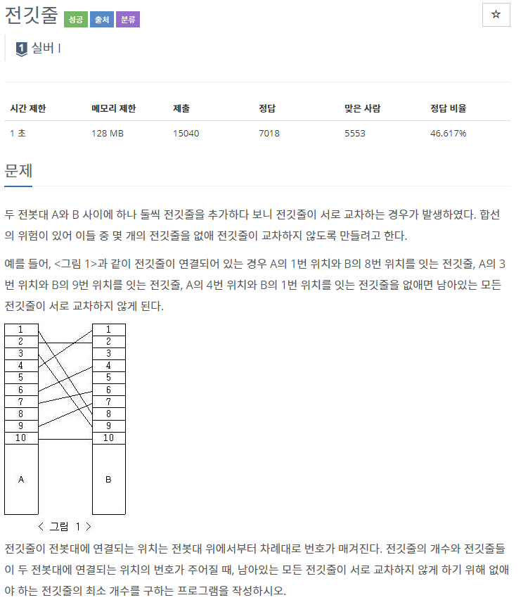
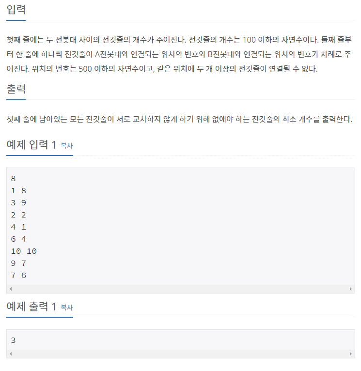

## [[2565] 전깃줄](https://www.acmicpc.net/problem/2565)



___
## 💡풀이
- 동적계획법을 이용하였다.
- Bottom-up 방식으로 구현하였다.
	- [가장 긴 증가하는 부분 수열](https://github.com/seonpilKim/Algorithm/tree/master/Dynamic%20Programming/BOJ/11053)의 길이를 구하는 방식을 활용하였다.
    - 전깃줄 A를 번호 순서대로 탐색하면서, 연결된 전깃줄 B의 번호가 증가하는 형태면, 줄이 꼬이지 않는다는 점을 이용하였다.
    - `총 전깃줄 개수`에서 `LIS를 만족하도록 연결된 전깃줄의 개수`를 빼면, 서로 교차하지 않게 하기 위해 없애야 하는 전깃줄의 `최소 개수`를 구할 수 있다.
```c++
// Base condition
fill(dp, dp + N, 1);

int a, b;
for (int i = 0; i < N; i++) {
    cin >> a >> b;
    A.emplace_back(a, b);
}
// 입력을 전깃줄의 번호 순서대로 받는 것이 아니므로, 정렬 해 준다.
sort(A.begin(), A.end());

// Bottom-up
int longest = 1;
for (int i = 0; i < A.size(); i++) {
    for (int j = 0; j < i; j++) {
        if (A[i].second > A[j].second && dp[i] < dp[j] + 1) {
            dp[i] = dp[j] + 1;
            if (dp[i] > longest)
                longest = dp[i];
        }
    }
}

cout << N - longest;
```