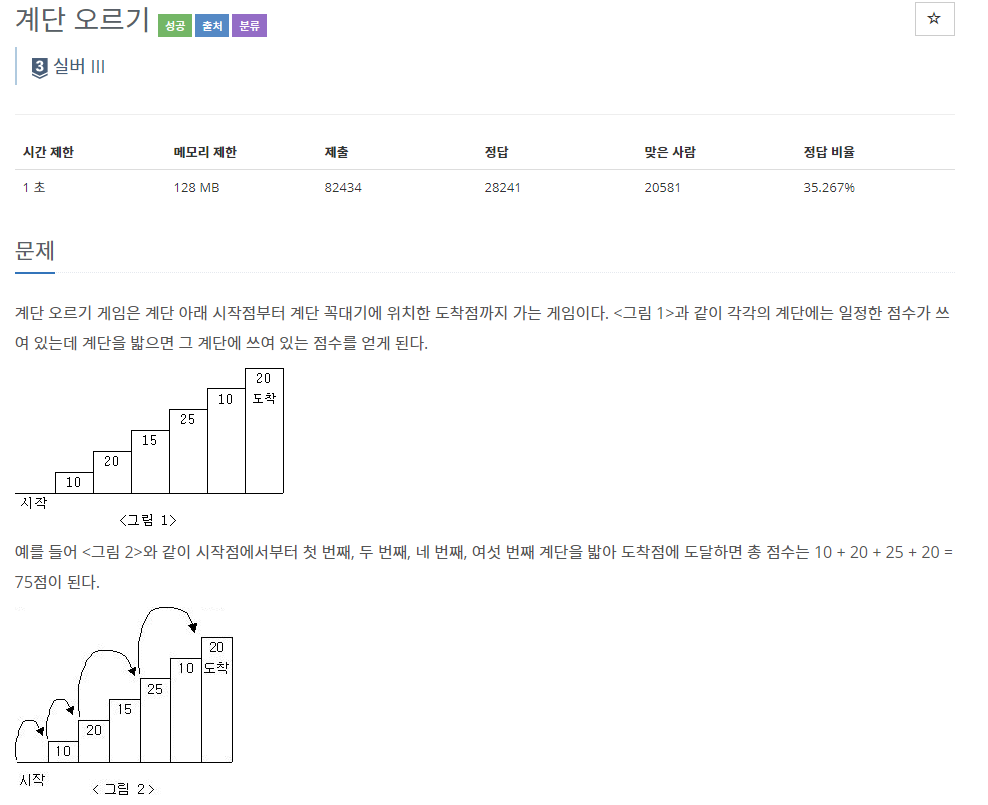
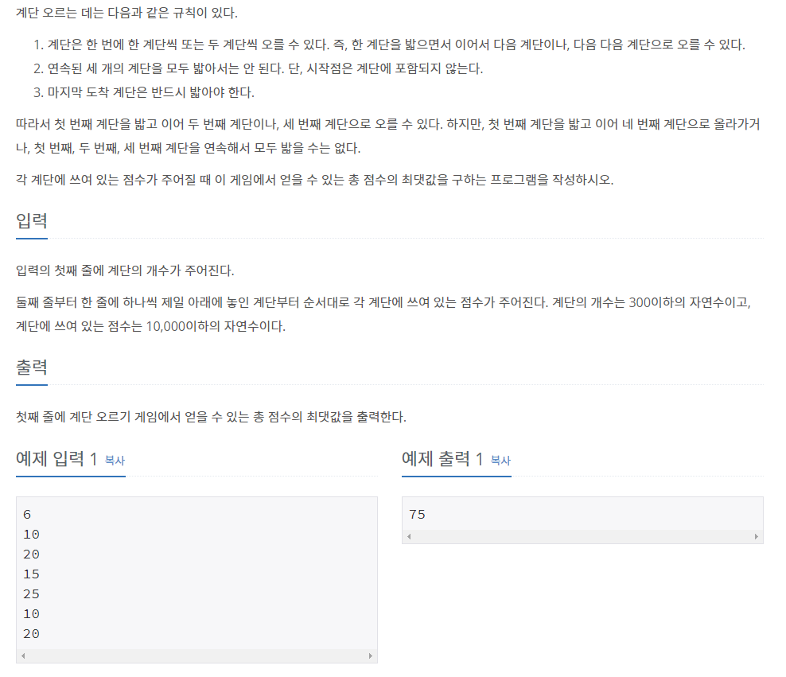

## [[2579] 계단 오르기](https://www.acmicpc.net/problem/2579)



___
## 💡풀이
- 동적계획법을 이용하였다.
- bottom-up 방식으로 구현하였다.
	- 각 층마다, i-1층에서 올라왔는지, i-2층에서 올라왔는지에 따라 점수를 다르게 저장한다.
		> dp[i][0] : i-2 층에서 2칸 올라왔을 때의 점수<br>
		> dp[i][1] : i-1 층에서 1칸 올라왔을 때의 점수
	- 점화식
		- `dp[i][0] += dp[i - 2][1]`
		- `dp[i][1] += max(dp[i - 1][0], dp[i - 2][1])`
	- 기저조건
		- `dp[0][0] = dp[0][1] = 0`
```c++
// Bottom-up
   for (int i = 2; i <= N; i++) {
       dp[i][0] += dp[i - 2][1];
       dp[i][1] += max(dp[i - 1][0], dp[i - 2][1]);
   }
   cout << max(dp[N][0], dp[N][1]);
```