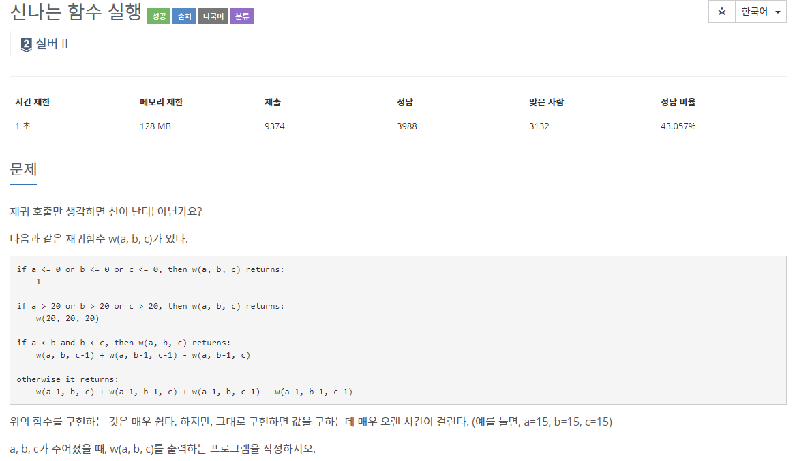
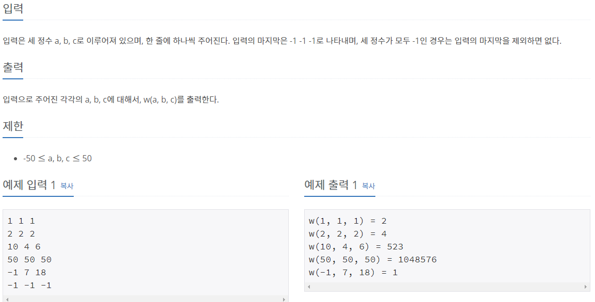

## [[9184] 신나는 함수 실행](https://www.acmicpc.net/problem/9184)



___
## 💡풀이
- 동적계획법을 이용하였다.
- top-down방식으로 구현하였으며, 주어진 조건을 활용하여 사용할 캐시용량을 최소화하였다.
```c++
int function(int a, int b, int c) {
	// 첫 번째 조건
    if (a <= 0 || b <= 0 || c <= 0)
        return 1;
	// 두 번째 조건
    else if (a > 20 || b > 20 || c > 20) {
		// 메모이제이션
        if (dp[20][20][20] != 0)
            return dp[20][20][20];
        return dp[20][20][20] = function(20, 20, 20);
    }

	// 메모이제이션
    if (dp[a][b][c] != 0)
        return dp[a][b][c];
	// 세 번째 조건
    else if (a < b && b < c) {
        int r1, r2, r3;
        r1 = function(a, b, c - 1);
        r2 = function(a, b - 1, c - 1);
        r3 = function(a, b - 1, c);

        return dp[a][b][c] = r1 + r2 - r3;
    }
	// 네 번째 조건
    else {
        int r1, r2, r3, r4;
        r1 = function(a - 1, b, c);
        r2 = function(a - 1, b - 1, c);
        r3 = function(a - 1, b, c - 1);
        r4 = function(a - 1, b - 1, c - 1);

        return dp[a][b][c] = r1 + r2 + r3 - r4;
    }
}
```