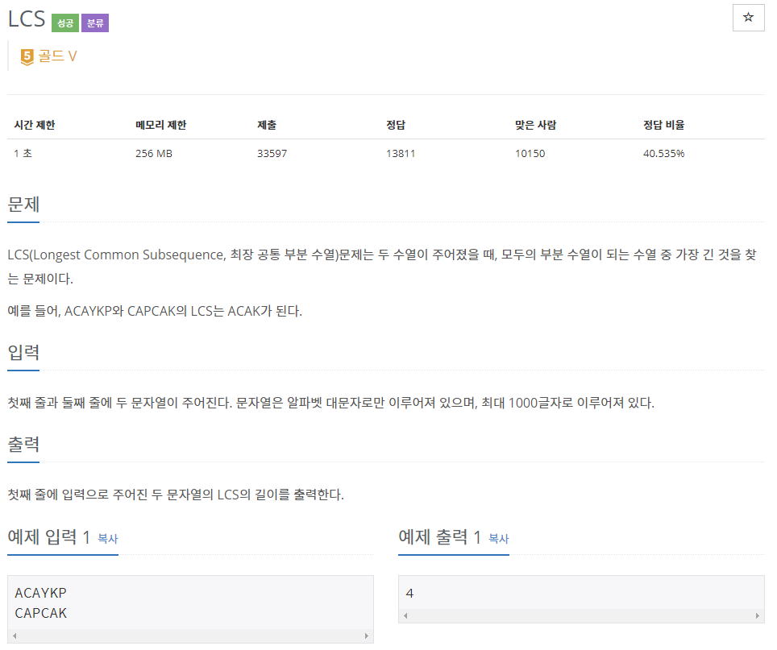
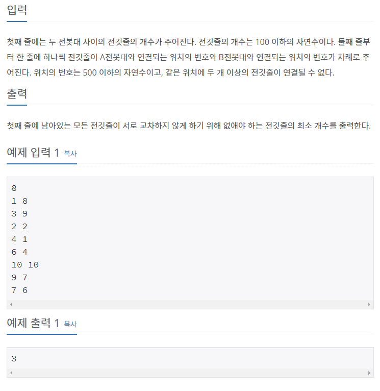

## [[9251] LCS](https://www.acmicpc.net/problem/9251)


___
## 💡풀이
- 동적계획법을 이용하였다.
- Bottom-up 방식으로 구현하였다.
	- 첫 번째 문자열 str의 문자를 순서대로 탐색하면서, cmp의 문자열의 각 문자를 순서대로 가져와서 비교한다.
    - `dp[i][j]`에 `첫 번째 문자열의 1 ~ i 부분 문자열`과 `두 번째 문자열의 1 ~ j 부분 문자열`을 비교했을 때의 `LCS값`을 저장한다.
    - 점화식
        - 첫 번째 문자열의 i 번째 문자와 두 번째 문자열의 j 번째 문자가 `동일한` 경우
            - `dp[i][j] = dp[i - 1][j - 1] + 1`
            - 두 문자열 각각 현재 문자에서 한 칸 이전의 문자까지 비교했을 때의 LCS값에 1을 더하여 현재(i, j) LCS값에 저장한다.
                > ex) i = 2, j = 2인 경우<br>
                > - 첫 번째 부분 문자열(0~1)과 두 번째 부분 문자열(0~1)을 비교했을 때의 LCS값에 1을 더하여 dp[2][2]에 저장
        - 그렇지 않은 경우
            - `dp[i][j] = max(dp[i - 1][j], dp[i][j - 1])`
            - 두 문자열을 한 번씩 번갈아서 한 칸 이전의 문자와 각각 비교했을 때의 LCS값 중, max값을 현재(i, j) LCS값에 저장한다.
                > ex) i = 2, j = 2인 경우<br>
                > 1. 첫 번째 부분 문자열(0~1)과 두 번째 부분 문자열(0~2) 비교<br>
                > 2. 첫 번째 부분 문자열(0~2)과 두 번째 부분 문자열(0~1) 비교
    - 예시
        - 
```c++
// Base condition : dp[0][1 ~ cmp.size()], dp[1 ~ str.size()][0] = 0

// Bottom-up
for (int i = 1; i <= str.size(); i++) {
    for (int j = 1; j <= cmp.size(); j++) {
        if (str[i - 1] == cmp[j - 1])
            dp[i][j] = dp[i - 1][j - 1] + 1;
        else
            dp[i][j] = max(dp[i - 1][j], dp[i][j - 1]);
    }
}

cout << dp[str.size()][cmp.size()];
```