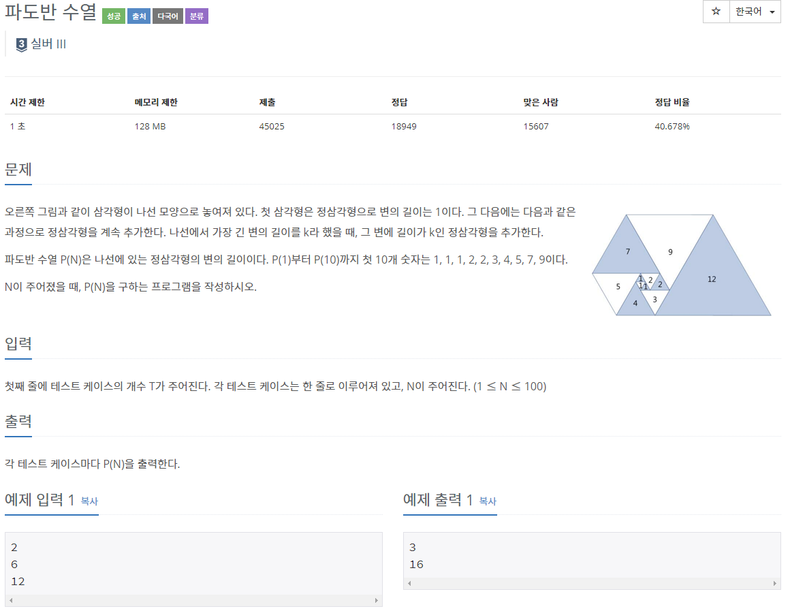

## [[9461] 파도반 수열](https://www.acmicpc.net/problem/9461)


___
## 💡풀이
- 동적계획법을 이용하였다.
- bottom-up 방식으로 구현하였다.
	- 점화식 : `dp[i] = dp[i - 1] + dp[i - 5]`
	- 기저조건 : `dp[1] = dp[2] = dp[3] = 1`, `dp[4] = dp[5] = 2`;`
- 추가로, dp를 int형으로 선언하면 overflow가 발생하므로 long long형으로 선언해야 한다.
```c++
// base condition
    dp[1] = dp[2] = dp[3] = 1;
    dp[4] = dp[5] = 2;

// bottom-up
for (int i = 6; i <= 100; i++) 
    dp[i] = dp[i - 1] + dp[i - 5];
```