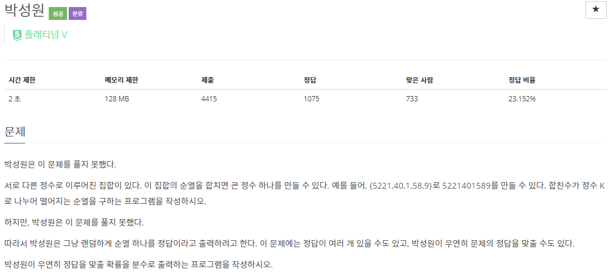

# [[1086] 박성원](https://www.acmicpc.net/problem/1086)




___
## 🤔접근
1. <b>모든 순열을 고려해야 한다.</b>
	- 모든 경우의 수를 확인하면 시간복잡도는 `O(N!)`이며, N은 최대 15이므로 매우 많은 시간이 소요된다.
	- 작은 문제로 큰 문제를 해결하는 DP 방식으로 시간복잡도를 개선하자.
2. <b>입력으로 받는 자연수의 자릿수는 최대 50자리 이다.</b>
	- 15개의 자연수가 모두 50자리라면, 최대 750자리의 수를 처리해야 하는데, 이것을 정수형으로 처리하는 것은 불가능하다.
	- 그러므로 입력을 문자열로 받되, 정수형으로 바꾸어 처리해야 한다.
	- 그러나, 여기서 정확한 수를 굳이 알 필요가 없다.
		- 필요한 것은 순열의 모든 경우에서 합친 수들을 각각 K로 나누었을 때, 나머지가 0이냐 아니냐를 알아내는 것이다.
		- 모듈러 연산의 특징을 이용하면 각 자리수를 분해하여 원하는 결과를 얻을 수 있다.
3. <b>최종 결과를 기약분수 형태로 나타내야 한다.</b>
	- 따라서 총 경우의 수와, 정답을 맞출 경우의 수의 gcd(최대공약수)를 구하여 각각 나누어주자.
___
## 💡풀이
- <b>DFS</b>를 이용한 <b>Top-down 동적 계획법</b>을 이용하였다.
	- `dp[num][bitmask]`: 각 순열에 존재하는 자연수들을 합칠 때 사용된 자연수들에 대한 정보가 담긴 bitmask에 따라 num이라는 값이 만들어졌을 때, 여기에 사용되지 않은 다른 자연수들을 이용하여 만들 수 있는 mod로 나누어 떨어지는 수들의 총 개수
		- `bitmask`: 최대 15자리의 bit가 주어지며, 순열을 합칠 떄 사용된 자연수는 1로 표현, 사용하지 않은 자연수는 0으로 표현
	- Top-down 으로 구현한 방식은 아래와 같다.
		- `Termination condition`: 주어진 모든 자연수가 포함된 순열을 합친 결과인 num을 mod로 나누었을 때, 나누어 떨어지면 true, 그렇지 않으면 false 반환.
		- `Base condition`: dp 배열의 모든 값을 -1으로 초기화, tenPow[0]에 10^0을 mod로 나눈 나머지 저장.
		- `Memoization`: 주어진 정보(num, bitmask)에 따라 합친 수를 mod로 나눈 결과가 이미 존재하면, 캐시에 저장되어 있는 값 재활용.
		- `Recurrence relation`: dp[num][bitmask] += DFS((num * tenPow[p[i].second] + p[i].first) % mod, bitmask | (1 << i))
			- `p[i].first`: i번째 자연수를 mod로 나눈 나머지
			- `p[i].second`: i번째 자연수의 자릿수
			- `(num * tenPow[p[i].second] + p[i].first) % mod`: num과 i번째 자연수를 합친 자연수를 mod로 나눈 나머지
				- `tenPow[p[i].second]`: <b>10^(i번째 자연수의 자릿수)</b>를 mod로 나눈 나머지
	
___
## ✍ 피드백
- 순열이라는 단어에는 `모든 원소를 정확히 한 번 사용한다`라는 조건이 포함되어 있다.
	- 우리가 배우고 사용하던 <b>nPr</b>은 따지자면, 부분순열에 해당한다.
	- Reference: https://en.wikipedia.org/wiki/Permutation#k-permutations_of_n
- 모듈러 연산의 특징
	- 모듈러 연산은 덧셈과 곱셈에 대해 분해할 수 있다.
	- `a % mod == (((a / 10) % mod) * 10) % mod`
		> ex) 100 % 7 == ((10 % 7) * 10) % 7
		> - 100 % 7 = 2
		> - 10 % 7 = 3, 30 % 7 = 2
___
## 💻 핵심 코드
```c++
int main(){
	...
	tenPow[0] = 1 % mod; // 10^0 % mod
	// a % mod == (((a / 10) % mod) * 10) % mod
	for (int i = 1; i <= MAX_LENGTH; i++)
		tenPow[i] = (tenPow[i - 1] * 10) % mod; // 10^i % mod

	for (int i = 0; i < N; i++) {
		reverse(nums[i].begin(), nums[i].end());

		// (a * b) % mod == ((a % mod) * b) % mod
		for (int j = 0; j < nums[i].size(); j++)
			p[i].first += ((nums[i][j] - '0') * tenPow[j]) % mod;
		p[i].first %= mod;
		p[i].second = nums[i].size();
	}

	long long correctCase = DFS(0, 0);
	long long g = gcd(totalCase, correctCase);

	cout << correctCase / g << '/' << totalCase / g;
}
long long DFS(int num, int bitmask) {
	if (bitmask == (1 << N) - 1)
		return num % mod == 0 ? true : false;
	if (dp[num][bitmask] != -1)
		return dp[num][bitmask];
	
	dp[num][bitmask] = 0;
	for (int i = 0; i < N; i++) {
		if (bitmask & (1 << i))
			continue;

		dp[num][bitmask] += DFS((num * tenPow[p[i].second] + p[i].first) % mod, bitmask | (1 << i));
	}

	return dp[num][bitmask];
}
```