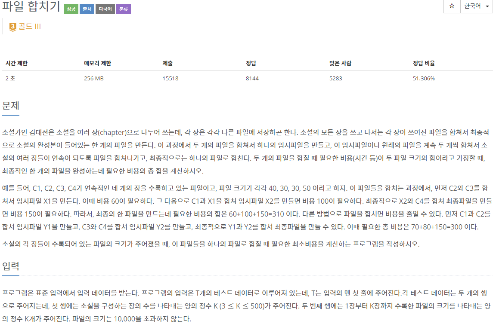
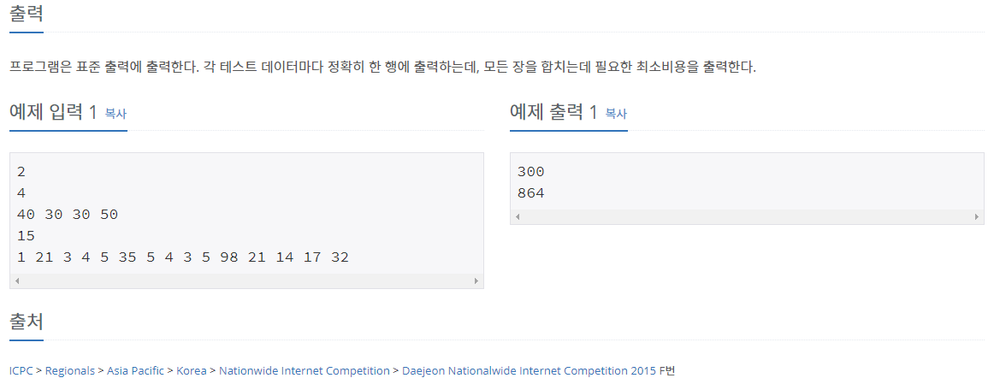

## [[11066] 파일 합치기](https://www.acmicpc.net/problem/11066)



___
## 💡풀이
- <b>동적계획법을 이용하였다.</b>
	- 문제에서 다음 문장에 주목하자.
	- "두 개의 파일을 합쳐서 하나의 임시파일을 만들고, 이 임시파일이나 원래의 파일을 계속 두 개씩 합쳐서 `소설의 여러 장들이 연속이 되도록 파일을 합쳐`나가고, 최종적으로는 하나의 파일로 합친다."
		> 예를들어 연속적인 파일 f1, f2, f3, f4이 있다면, 이 파일들을 아래와 같이 두 그룹으로 나눌 수 있다.
		> - {f1} {f2, f3, f4}
		> - {f1, f2} {f3, f4}
		> - {f1, f2, f3} {f4}<br>
		
	- 이 그룹들을 하나의 그룹으로 합칠 때, 최소 비용으로 합치는 방법을 찾는 문제이므로, `각각의 부분 문제(그룹)들을 하나의 큰 문제(그룹)로 합치는 방식`, 즉 동적계획법으로 해결할 수 있다.
	- <b>Bottom-up 점화식</b>
		- `dp[first][last] = min(dp[first][last], dp[first][mid] + dp[mid + 1][last] + prefix_sum);`
	- <b>분석</b>
		- `dp[first][last]`
			- first file부터 last file까지 연속이 되도록 파일을 합쳤을 때의 총 최소 비용
		- `dp[first][mid] + dp[mid + 1][last]`
			- 각 dp 배열에 저장된 값은 mid file을 경계로 두 그룹으로 나누었을 때, 각각 그룹에 속한 파일들을 합친 임시 파일 비용
			- 즉, 두 dp 배열에 저장된 값은 각 임시 파일을 생성하기까지의 총 최소 비용이다.
		- `prefix_sum` = `sum[last] - sum[first - 1]`
			- first file부터 last file까지 각 비용의 부분 합
			- 즉, 새로운 임시 파일에 속하게 될 총 파일들의 비용 합이다.
		- 즉, dp 배열에는 현재 하나의 큰 파일이 만들어지기까지 `생성된 총 임시파일들의 비용`과 현재 파일에 속한 `각각의 작은 파일들의 비용`을 더한 값 저장된다.
	- <b>구현 방법</b>
		- 첫 번째 파일부터 K번째 파일까지, 각각 두 그룹으로 나누는 범위를 1개부터 K-1개까지 순차적으로 증가시키면서, 각 최소 비용을 메모이제이션하며 피라미드 형태로 쌓아 올라가는 Bottom-up 방식으로 구현하였다.
		- 자세한 구현 방법은 코드의 주석을 참고❗
		- 시간 복잡도 : `O(N³)`
___
## ✍ 피드백
- 처음에는 두 번째 예제의 원리를 파악하는 데 시간을 너무 허비했다.
	- 결국 원리를 파악하지 못하여 힌트를 보고 이해하게 되었다.😂😂
- 결국 문제를 `꼼꼼히` 읽으며 `핵심 문장`을 찾는 것이 가장 중요한 것 같다.
	- 소설의 여러 장들이 `연속`이 되도록 파일을 합쳐 나가야 한다는 조건을 인지하지 못한채로, 각 비용들을 정렬하고 있는 자신을 보기싫다면 말이다...😇
	- 결국, 위의 조건을 통해 첫 번째 예시의 주어진 비용들에서 경우의 수를 나누어 보면서, 각각을 부분 문제로 여기어 하나의 큰 문제로 합쳐야 한다는 것을 깨달았다❗
___
## 💻 코드
```c++
// for Prefix-Sum(부분 합)
// base-condition: sum[0] = 0
vector<int> sum(K + 1, 0); 

// base-condition: dp[i][j] = 0 (0 <= i, j <= K)
vector<vector<int>> dp(K + 1, vector<int>(K + 1, 0));

for (int i = 1; i <= K; i++) {
	int cost;
	cin >> cost;
	sum[i] = sum[i - 1] + cost; // 누적 합
}

// range between two groups : [1, K)
/* 
	- 모든 파일을 각각 1개씩 두 그룹으로 나누어 임시파일을 만드는 것 부터 K-1개씩 두 그룹으로 나누어 임시파일을 만드는 것 까지의 모든 경우의 수를 확인하기 위해 range를 가장 바깥 쪽의 loop에 두었다.
	- 두 그룹을 나누는 범위를 K까지 포함하면 하나의 그룹이 되므로, 포함하지 않는 것에 주의!
*/
for (int range = 1; range < K; range++) {
	// last: 두 번째 그룹의 마지막 원소 -> K를 초과하면 인덱스 범위 초과!
	for (int first = 1; first + range <= K; first++) {
		int last = first + range;
		int prefix_sum = sum[last] - sum[first - 1];

		/*
			- base-condition
			- 처음 dp 값은 0으로 초기화되어 있으므로, 표현 가능한 정수형의 최대 값을 넣어준다.
		*/
		dp[first][last] = INT_MAX;
		
		/*
			- mid : [first, last)
			- mid는 첫 번째 그룹의 가장 마지막 파일을 가리킨다.
			- mid의 범위가 last까지 포함되면 하나의 그룹이 되므로, 포함하지 않는 것에 주의!
		*/
		for (int mid = first; mid < last; mid++)
			dp[first][last] = min(
				dp[first][last],
				dp[first][mid] + dp[mid + 1][last] + prefix_sum);
	}
}

cout << dp[1][K] << '\n';
```
