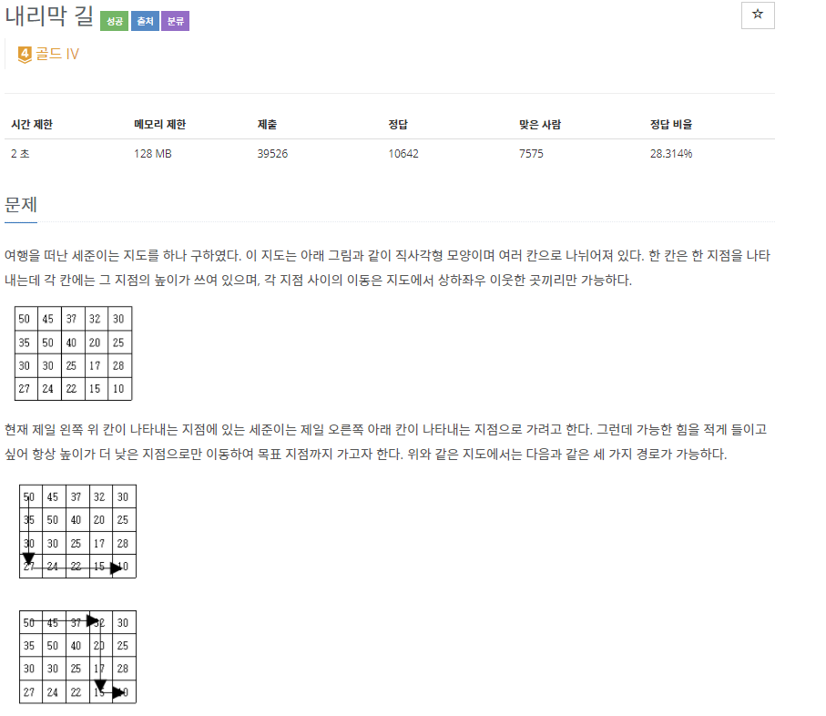

## [[1520] 내리막 길](https://www.acmicpc.net/problem/1520)



___
## 💡풀이
- <b>DFS, 동적계획법을 이용하였다.</b>
	- 메모이제이션 없이 DFS으로만 문제를 풀면, 한 정점에서 4방향 모두 탐색하는 과정에서 중복 탐색의 횟수가 매우 많아진다. -> `TLE`
	- 그러므로 한 번 정점에 대한 경로들이 정해졌다면, DFS 재귀 호출을 하지 않고 캐시 값을 꺼내어 사용하는 방식으로 구현해야한다.
	- <b>Top-down 점화식</b>
		```c++
		for (int i = 0; i < 4; i++) {
			int new_row = row + dr[i];
			int new_col = col + dc[i];

			if (!isValid(new_row, new_col))
				continue;

			if (map[row][col] > map[new_row][new_col])
				dp[row][col] += DFS(new_row, new_col);
		}		
		``` 
	- <b>분석</b>
		- 4방향에 대해 현재 위치의 높이보다 작은 높이가 존재하면, 해당 위치로 깊이우선탐색을 수행하여 도착 지점까지의 총 경로의 수를 현재 위치의 캐시에 저장하는 방식으로 구현하였다.
		- <b>Termination-condition</b>
			```c++
			if (row == r - 1 && col == c - 1)
				return 1;
			```
		- <b>Memoization</b>
			```c++
			// 결과 재활용
			if (dp[row][col] != UNVISITED)
				return dp[row][col];
			...
			// 결과를 캐시에 저장
			if (map[row][col] > map[new_row][new_col])
				dp[row][col] += DFS(new_row, new_col);			
			```
___
## ✍ 피드백
- 처음에는 DFS로만 접근하여 TLE를 받았다.😢
- 4방향으로 깊이우선탐색을 하다보니, 중복으로 탐색하는 횟수가 매우 많다는 것을 깨닫고, 동적계획법을 떠올렸다.
	- DFS를 재귀호출 방식으로 구현했다보니, 동적계획법도 똑같이 재귀호출 방식으로 구현하기 위해 Top-down 방식을 사용하였다.
	- 지금까지 대부분 Bottom-up 방식으로 구현을 하다보니, 생각보다 Top-down 방식이 조금 낯설게 느껴졌다.. 자주 애용하도록 하자❗
___
## 💻 핵심 코드
```c++
int DFS(int row, int col) {
	if (row == r - 1 && col == c - 1)
		return 1;

	if (dp[row][col] != UNVISITED)
		return dp[row][col];
	
	dp[row][col] = 0;
	for (int i = 0; i < 4; i++) {
		int new_row = row + dr[i];
		int new_col = col + dc[i];

		if (!isValid(new_row, new_col))
			continue;

		if (map[row][col] > map[new_row][new_col])
			dp[row][col] += DFS(new_row, new_col);
	}

	return dp[row][col];
}
```