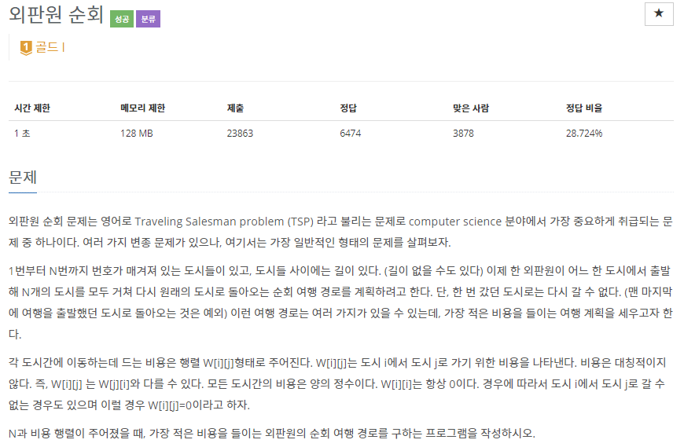

# [[2098] 외판원 순회](https://www.acmicpc.net/problem/2098)




___
## 💡풀이
- <b>DFS</b>를 이용한 <b>Top-down 동적 계획법</b>을 이용하였다.
	- `dp[cur][bitmask]`: 0번 도시에서 cur 도시까지의 여행 경로 최소 비용
		- `bitmask`: 최대 16개의 bit를 이용하여 방문한 도시는 1, 방문하지 않은 도시는 0으로 표현
	- Top-down 방식으로 구현 방식은 아래와 같다.
		- `Termination condition`: 모든 도시를 방문한 경우, 현재 도시에서 0번 도시로 가는 비용 반환
		- `Base condition`: dp 배열의 모든 값을 -1으로 초기화
		- `Memoization`: 0번 도시에서 현재 도시까지의 여행 경로 최소 비용이 -1이 아니라면, 캐시에 저장된 값을 재활용.
		- `Recurrence relation`: dp[cur][bitmask] = min(dp[cur][bitmask], DFS(i, bitmask | (1 << i)) + city[cur][i])
	
___
## ✍ 피드백
- 0번이 아닌 다른 도시에서 시작했을 때 최적이 되는 경로가 있다고 가정해보자. 
	- 그럼 그 경로 역시 0번 도시를 중간에 거쳐갈 것이고, 전체 경로는 사이클을 이룬다.
	- 따라서 0번 도시에서 출발하는 것만 고려하더라도, 같은 사이클을 만드는 경우까지 고려하게 된다.
___
## 💻 핵심 코드
```c++
int main(){
	...
	// 0번 도시에서 출발하므로 bitmask = 1로 시작
	cout << DFS(0, 1);
	...
}
int DFS(int cur, int bitmask) {
	if (bitmask == (1 << N) - 1) {
		// 현재 도시(cur)에서 0번 도시로 가는 길이 있는 경우
		if (city[cur][0] != 0)
			return city[cur][0]; // 비용 반환
		// 없는 경우
		return MAX_COST;
	}
	// 메모이제이션
	if (dp[cur][bitmask] != -1)
		return dp[cur][bitmask];

	dp[cur][bitmask] = MAX_COST;
	for (int i = 0; i < N; i++) {
		// i번 도시는 이미 방문한 경우, continue
		if (bitmask & (1 << i))
			continue;
		// 현재 도시에서 i번 도시로 가는 경로가 없는 경우, continue
		if (city[cur][i] == 0)
			continue;

		dp[cur][bitmask] = min(dp[cur][bitmask], DFS(i, bitmask | (1 << i)) + city[cur][i]);
	}

	return dp[cur][bitmask];
}
```