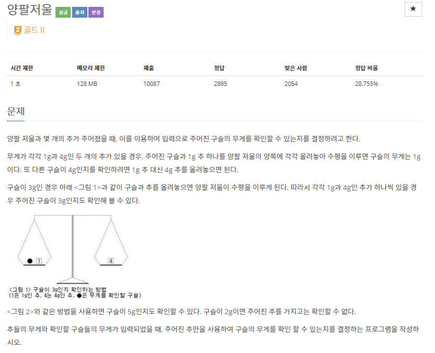

## [[2629] 양팔저울](https://www.acmicpc.net/problem/2629)



___
## 💡풀이
- <b>DFS, 동적계획법을 이용하였다.</b>
	- 두 개의 추 A, B가 주어졌을 때, 다음 4가지 경우의 구슬 무게를 알 수 있다. 
		1. A
		2. B
		3. abs(A-B)
		4. A+B
	- 추를 순서대로 탐색하면서 다음과 같이 재귀함수를 구현하면 모든 경우의 수를 완전탐색이 가능하다.
		1. 이번 추를 왼쪽 저울에 올리는 경우, 현재 무게에 덧셈
		2. 이번 추는 건너 뛰는 경우
		3. 이번 추를 오른쪽 저울에 올리는 경우, 현재 무게에 뺄셈
	- 여기서 중요한 점은, 메모이제이션을 활용하여 이미 탐색한 무게는 return해야 꽤 많은 시간을 절약할 수 있다는 점이다.
	- 또한, 추의 최대 개수는 30개이고, 최대 무게는 500g인데 주어지는 구슬의 최대 무게는 40,000이지만, 추로 표현할 수 있는 최대 무게는 15,000이다. 그러므로 15,000 이상의 입력에 대해서는 `N`을 출력함으로써 시간을 단축할 수 있다.
___
## ✍ 피드백
- 처음에는 "어떻게 DP를 이용하여 모든 경우의 수를 구해야 할까?"에 초점을 두고 방법을 생각하려다보니 방법이 잘 떠오르지 않았다.
- 이후, DFS를 통해 3가지 경우로 나누어서 탐색하는 쪽으로 먼저 구현한 다음, 중복 탐색을 줄이기 위해 DP를 이용하는 순서로 구현하니 훨씬 매끈하게 진행되었다.
___
## 💻 핵심 코드
```c++
// Top-down
void DFS(int idx, int sum) {
	if (idx > N || dp[idx][sum])
		return;

	dp[idx][sum] = true;

	DFS(idx + 1, sum + sinkers[idx]);
	DFS(idx + 1, sum);
	DFS(idx + 1, abs(sinkers[idx] - sum));
}
```