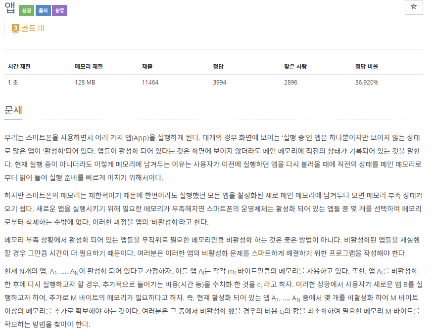
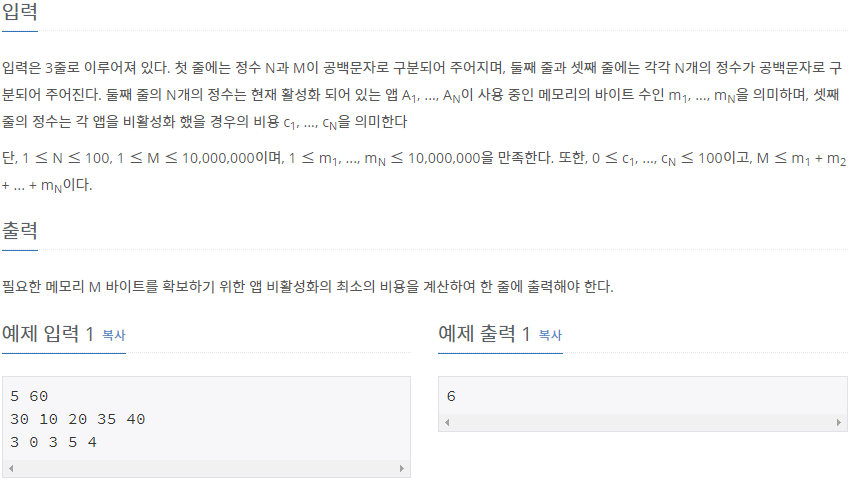

# [[7579] 앱](https://www.acmicpc.net/problem/7579)




___
## 💡풀이
- <b>동적계획법</b>을 이용하였다.
	- knapsack 알고리즘과 비슷한 방식으로 접근하였으며, dp 배열을 다음과 같이 정의하였다.
		- `dp[n] : 앱 비활성화의 비용이 n일 때, 최대 확보 메모리 바이트`
		- 따라서 점화식은 다음과 같이 정의할 수 있다.
			- `dp[j] = max(dp[j], dp[j - cost[i]] + memory[i])`
				- i : i 번째 앱
				- j : 비활성화 비용
	- 최종적으로 비용이 0일 때부터, 10000까지 오름차순으로 탐색하면서, 확보 메모리 바이트가 M 이상인 부분을 찾음으로써, 원하는 결과를 얻을 수 있다.
___
## ✍ 피드백

___
## 💻 핵심 코드
```c++
vector<int> dp(10001);
for (int i = 0; i < N; i++)
	for (int j = 10000; j >= cost[i]; j--)
		dp[j] = max(dp[j], dp[j - cost[i]] + memory[i]);

for (int i = 0; i <= 10000; i++) {
	if (dp[i] >= M) {
		cout << i;
		break;
	}
}
```