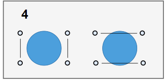

## [[17268] 미팅의 저주](https://www.acmicpc.net/problem/17268)


___
## 🤔접근
- 수열을 구해 보면, {1, 2, 5, 14, ...} 을 얻을 수 있다.<br>
    <br>
    <br>
    
    - 이는 `카탈란 수열`에 해당한다. 
___
## 💡풀이
- <b>알고리즘 & 자료구조</b>
    - `DP`
- <b>구현</b>
    - `카탈란 수열`의 점화식은 다음과 같다.<br>
        
    - 문제에서는 숫자가 짝수로만 존재하므로, 아래와 같이 변형해야 한다.
        ```c++
        // 초기값
        dp[0] = 1;
        dp[2] = 1;

        for (int i = 4; i <= N; i += 2)
            for (int j = 2; j <= i; j += 2)
                dp[i] += dp[j - 2] * dp[i - j]
        ```
___
## ✍피드백
- 수열 찾는 사이트: https://oeis.org/search?q=1%2C+1%2C+2%2C+5%2C+14&language=english&go=Search
___
## 💻핵심 코드
```c++
int main(){
    ...
    vector<long long> dp(N + 1);

    dp[0] = 1;
    dp[2] = 1;

    for (int i = 4; i <= N; i += 2)
        for (int j = 2; j <= i; j += 2)
            dp[i] = (dp[i] + dp[j - 2] * dp[i - j]) % 987654321;

    cout << dp[N];
    ...
}
```