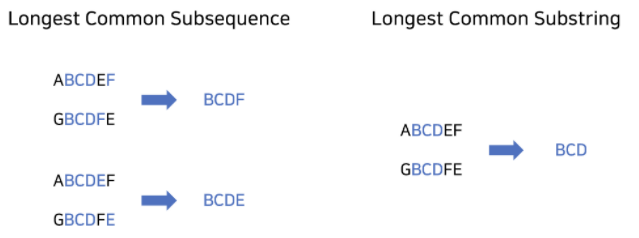
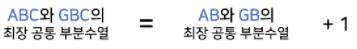
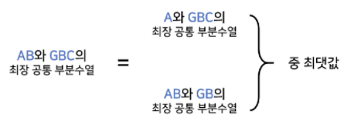
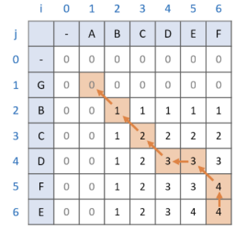

# LCS
## LCS의 두 가지 의미
1. `최장 공통 문자열(Longest Common Substring)`
    - 부분 수열이 아니기 때문에, 최장으로 이어져 있는 공통 문자열을 의미한다.
2. `최장 공통 부분 수열(Longest Common Subsequence)`
    - 부분 수열이기 때문에, 문자 사이를 건너 뛰며 최장으로 이어져 있는 공통 문자열을 의미한다.

___
## 최장 공통 문자열(Longest Common Substring)
- <b>점화식</b>
    ```c++
    vector<vector<int>> LCS(str1.size() + 1, vector<int>(str2.size() + 1, 0));
    for (int i = 1; i <= str1.size(); i++) {
        for (int j = 1; j <= str2.size(); j++) {
            if (str1[i - 1] == str2[j - 1])
                LCS[i][j] = LCS[i - 1][j - 1] + 1;
            else
                LCS[i][j] = 0;
        }
    }
    ```
- <b>과정</b>
    1. 두 문자열을 한 글자씩 비교한다.
    2. 두 문자가 다르다면, `LCS[i][j]`에 `0`을 대입한다.
        - 공통 문자열은 `연속`되어야 하기 때문
    3. 두 문자가 같다면, `LCS[i][j]`에 `LCS[i - 1][j - 1] + 1`을 대입한다.<br>
        
___
## 최장 공통 부분 수열(Longest Common Subsequence)
- <b>점화식</b>
    ```c++
    vector<vector<int>> LCS(str1.size() + 1, vector<int>(str2.size() + 1, 0));
    for (int i = 1; i <= str1.size(); i++) {
        for (int j = 1; j <= str2.size(); j++) {
            if (str1[i - 1] == str2[j - 1])
                LCS[i][j] = LCS[i - 1][j - 1] + 1;
            else
                LCS[i][j] = max(LCS[i - 1][j], LCS[i][j - 1]);
        }
    }
    ```
- <b>과정</b>
    1. 두 문자열을 한 글자씩 비교한다.
    2. 두 문자가 다르다면, `LCS[i][j]`에 `LCS[i - 1][j]`와 `LCS[i][j - 1]` 중 `큰 값`을 대입한다.
        - 공통 부분 수열은 연속된 값이 아니기 때문에, 계속해서 `유지`되어야 하기 때문<br>
        
    3. 두 문자가 같다면, `LCS[i][j]`에 `LCS[i - 1][j - 1] + 1`을 대입한다.<br>
        
___
## 최장 공통 부분 수열 찾기
- <b>점화식</b>
    ```c++
    int i = str1.size();
    int j = str2.size();
    int len = LCS[str1.size()][str2.size()];
    stack<char> subseq;

    cout << len << '\n';

    // find LCS
    while (len) {
        if (LCS[i - 1][j] == len)
            i--;
        else if (LCS[i][j - 1] == len)
            j--;
        else {
            subseq.push(str1[i - 1]);
            i--;
            j--;
            len--;
        }
    }

    while (!subseq.empty()) {
        cout << subseq.top();
        subseq.pop();
    }
    ```
- <b>과정</b>
    1. LCS 배열의 가장 마지막 값부터 탐색한다.
    2. `LCS[i - 1][j]`과 `LCS[i][j - 1]` 중 현재 값과 같은 값을 찾는다.
        1. 같은 값이 있다면, 해당 위치로 이동한다.
        2. 같은 값이 없다면, subseq 스택에 현재 문자를 담고, `LCS[i - 1][j - 1]`으로 이동한다.
    3. 위 과정을 len이 0이 될 때 까지 반복하고, subseq 스택에서 순서대로 꺼내면 LCS를 얻을 수 있다.

