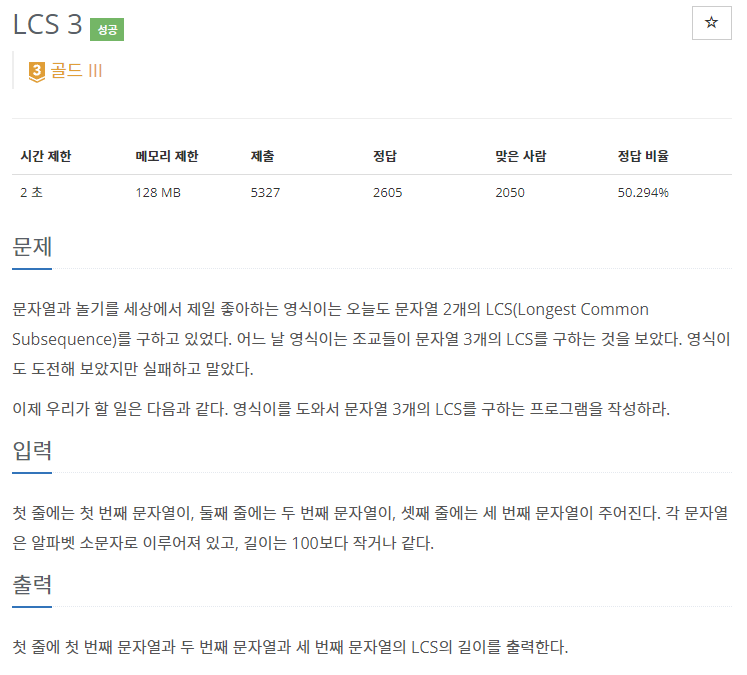

# [[1958] LCS 3](https://www.acmicpc.net/problem/1958)



___
## 🤔접근
___
## 💡풀이
- <B>알고리즘 & 자료구조</B>
    - `LCS`
___
## ✍ 피드백
___
## 💻 핵심 코드
```c++
int main() {
    ...

    vector<vector<vector<int>>> dp(str1.size() + 1, vector<vector<int>>(str2.size() + 1, vector<int>(str3.size() + 1)));

	for (int i = 1; i <= str1.size(); i++) {
		for (int j = 1; j <= str2.size(); j++) {
			for (int k = 1; k <= str3.size(); k++) {
				if (str1[i - 1] == str2[j - 1] && str2[j - 1] == str3[k - 1])
					dp[i][j][k] = dp[i - 1][j - 1][k - 1] + 1;
				else
					dp[i][j][k] = max({dp[i - 1][j][k], dp[i][j - 1][k], dp[i][j][k - 1]});
			}
		}
	}

	cout << dp[str1.size()][str2.size()][str3.size()];

    ...
}
```