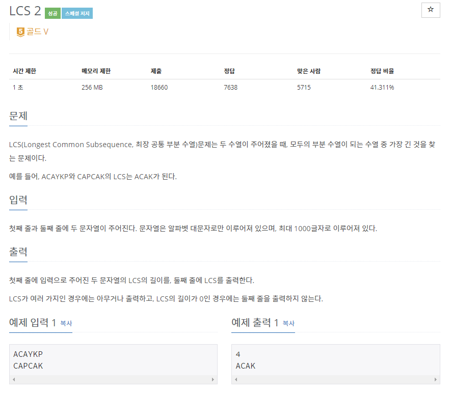

# [[9252] LCS 2](https://www.acmicpc.net/problem/9252)


___
## 🤔접근
___
## 💡풀이
- <B>알고리즘 & 자료구조</B>
    - `LCS`
___
## ✍ 피드백
___
## 💻 핵심 코드
```c++
int main() {
    ios_base::sync_with_stdio(false);
    cin.tie(nullptr);

    string str1, str2;
    cin >> str1 >> str2;

    vector<vector<int>> LCS(str1.size() + 1, vector<int>(str2.size() + 1));

    // find LCS length
    for (int i = 1; i <= str1.size(); i++) {
        for (int j = 1; j <= str2.size(); j++) {
            if (str1[i - 1] == str2[j - 1])
                LCS[i][j] = LCS[i - 1][j - 1] + 1;
            else
                LCS[i][j] = max(LCS[i - 1][j], LCS[i][j - 1]);
        }
    }

    int i = str1.size();
    int j = str2.size();
    int len = LCS[str1.size()][str2.size()];
    stack<char> subseq;

    cout << len << '\n';

    // find LCS
    while (len) {
        if (LCS[i - 1][j] == len)
            i--;
        else if (LCS[i][j - 1] == len)
            j--;
        else {
            subseq.push(str1[i - 1]);
            i--;
            j--;
            len--;
        }
    }

    while (!subseq.empty()) {
        cout << subseq.top();
        subseq.pop();
    }

    return 0;
}
```