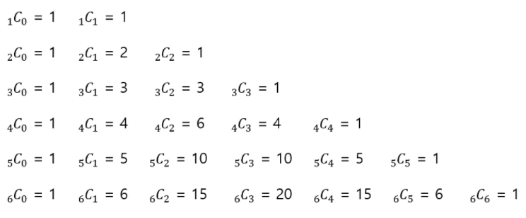
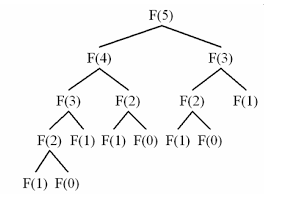

# 동적 계획법(Dynamic Programming)

## 🧐도입
- `동적 계획법(DP)`은 최적화 문제를 연구하는 수학 이론에서 왔으며, 일반적으로 전산학에서 사용하는 동적(dynamic), 혹은 프로그래밍(programming)이란 단어와는 아무런 관련이 없다.
___
## 📖개념
- `동적 계획법(DP)`은 큰 의미에서 `분할 정복`과 같은 접근 방식을 의미한다.
    - `분할 정복`
        - 큰 문제를 작은 문제들로 나누어, 각 조각의 답을 계산하고, 이 답들로부터 원래 구하려던 문제의 답을 계산해내는 방식
        - 쪼개진 작은 문제들이 서로 중복되지 않는 경우에 사용
- 동적 계획법과 분할 정복의 차이가 발생하는 부분은 `문제를 나누는 방식`이다.
    - `동적 계획법`은 어떤 부분 문제가 두 개 이상의 문제를 해결하는데 사용될 수 있기 때문에, 부분 문제를 `한 번만 계산하고, 계산 결과를 재활용`함으로써 `속도의 향상`을 꾀한다.
    - 이를 위해, 각 작은 문제의 답을 메모리에 저장하는데, 이 때의 메모리 장소를 `캐시(cache)`라고 부른다.
    - 또한, 부분 문제들의 결과를 캐시에 저장 해 뒀다가, 나중에 재활용하는 최적화 기법을 `메모이제이션(memoization)`이라고 부른다.
___
## ✅조건
- 큰 문제를 작은 문제들로 나눌 수 있는 경우
- 작은 문제들이 반복되는 경우
- 입력이 같을 때, 그 결과가 항상 같은 경우(`참조적 투명함수`)
## nCr, Combination(조합)
- 
    - 위에서 간단한 규칙을 찾아 점화식을 세울 수 있다.
    - `nCr = n-1Ⅽr-1 + n-1Ⅽr`
        - <b>Base condition</b>: n과 r이 같거나 r이 0일 때는 항상 1이다.
    - n이 클 수록 작은 문제들이 반복하는 횟수가 점차 많아지는 문제가 생긴다.
    - 이럴 때, 작은 문제들을 메모이제이션함으로써 최적화할 수 있다.
### 💻구현
```c++
vector<vector<int>> dp(MAX, vector<int>(MAX));
int nCr(int n, int r) {
	if (n == r || r == 0)
		return 1;
	if (dp[n][r])
		return dp[n][r];

	return dp[n][r] = nCr(n - 1, r - 1) + nCr(n - 1, r);
}
```
___
## 💡피보나치 수열
- 
    - F(5)를 구하려면 F(4)와 F(3)이 필요하고, 다시 F(4)를 구하려면 F(3)과 F(2)가 필요하다.
    - 작은 문제들이 반복되어 나오는 구조이다.
    - 입력 값이 같을 때, 항상 결과가 같게 나온다.
- 그러므로 동적계획법을 이용하여 해결할 수 있다.
### 구현 방법
- 구현 방법은 두 가지가 존재한다.
    1. Bottom-up 방식
    2. Top-down 방식
### 💻Bottom-up
- `반복문`을 이용하여 구현하며, 함수를 재귀호출하지 않기 때문에, 시간과 메모리 사용량을 줄일 수 있다는 장점이 있다.
```c++
int fibonacci(int n) {
    dp[0] = 0;
    dp[1] = 1;
    for (int i = 2; i <= n; i++)
      dp[i] = dp[i - 1] + dp[i - 2];
    return dp[n];
}
```
### 💻Top-down
- `재귀호출` 방식으로 구현하며, 함수의 불필요한 반복 호출을 줄이기 위해 `메모이제이션`을 사용한다.
- 점화식 그대로 호출이 되기 때문에, 형식/순서에 얽매이지 않는다.
```c++
int fibonacci(int n) {
    if (n == 0) 
        return 0;
    else if (n == 1) 
        return 1;

    if (dp[n] != -1) 
        return dp[n];

    return dp[n] = fibonacci(n - 1) + fibonacci(n - 2);
}
```
___
## 🤔접근법
1. 동적계획법 조건을 만족하는지 확인
2. 점화식 or 재귀 과정 정의
    - 큰 문제를 작은 문제들로 나누어 정의
    - 기저 조건(Base condition) 정의
    - 종료 조건 정의
3. Bottom-up or Top-down 방식 구현