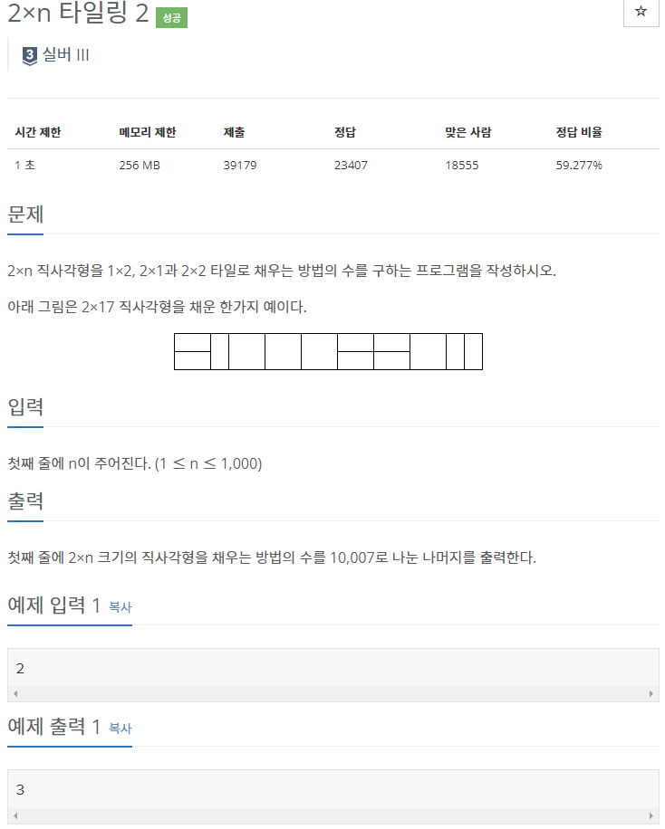
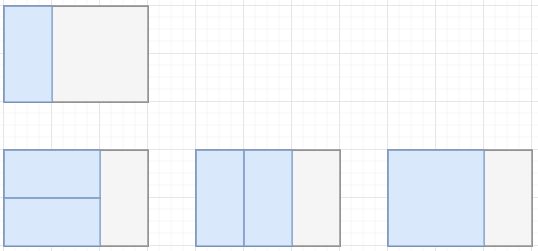

# [[11727] 2×n 타일링 2](https://www.acmicpc.net/problem/11727)


___
## 🤔접근
___
## 💡풀이
- <B>알고리즘 & 자료구조</B>
    - `DP - Tilling`
- <b>구현</b>
	- `1열과 2열을 채우는 방식`은 아래와 같다.<br>
		
		- <b>기저 조건:</b>
			- `dp[0] = 1`
			- `dp[1] = 1`
			- `dp[2] = 3`
	- <b>점화식</b>
		```c++
		for (int i = 3; i <= N; i++)
			dp[i] = (dp[i - 1] + 2 * dp[i - 2]);
		```
		- 2열을 채우는 방식은 2 x 1 타일과 2 x 2 타일 두 가지가 있으므로, `2 * dp[i - 2]`을 더해주었다.
___
## ✍ 피드백
___
## 💻 핵심 코드
```c++
int main() {
    ...

    dp[0] = 1;
	dp[1] = 1;
	dp[2] = 3;

	for (int i = 3; i <= N; i++)
		dp[i] = (dp[i - 1] + 2 * dp[i - 2]) % 10007;

	cout << dp[N];

    ...
}
```