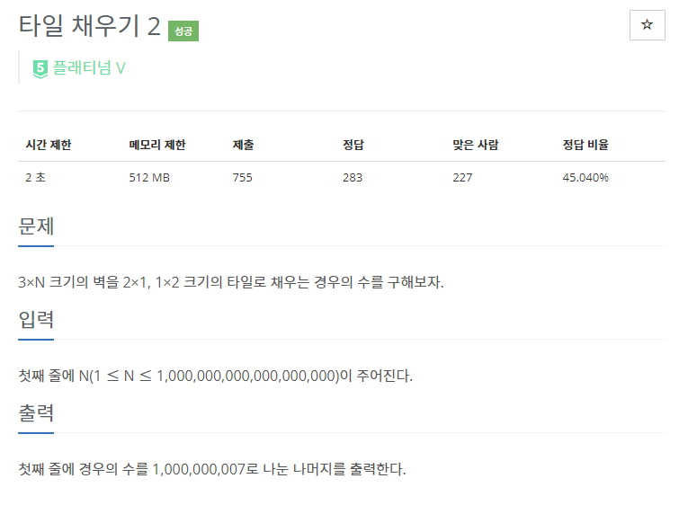
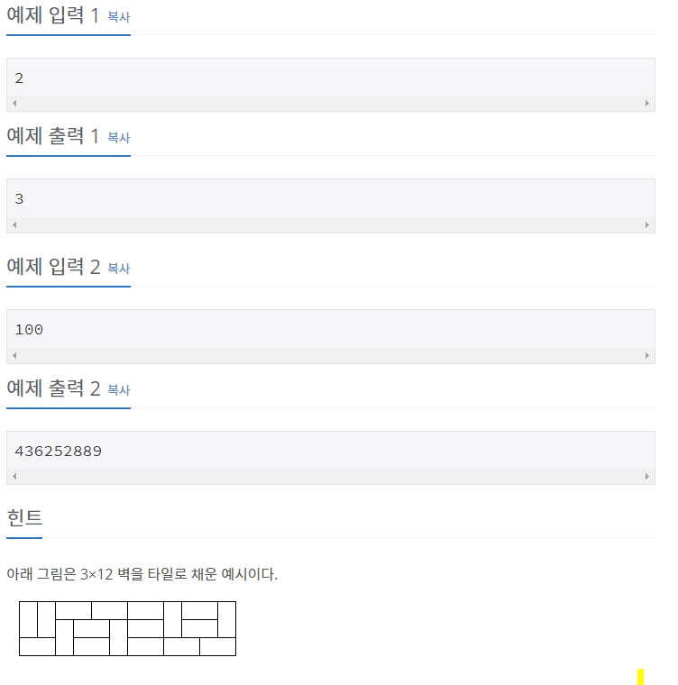
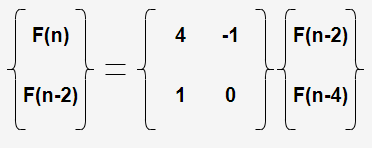

# [[13976] 타일 채우기 2](https://www.acmicpc.net/problem/13976)



___
## 🤔접근
___
## 💡풀이
- <B>알고리즘 & 자료구조</B>
    - `DP - Tilling`
	- `분할 정복을 이용한 행렬 거듭제곱`
- <b>구현</b>
	- [boj.2133](https://github.com/seonpilKim/Algorithm/tree/master/Dynamic%20Programming/Tilling/boj/2133) 문제와 거의 동일하나, N이 매우 크다는 점에서 차이가 있다.
	- N이 매우 크므로, `점화식을 선형 점화식으로 변형`시켜 행렬로 만들면, 분할 정복을 이용하여 행렬 거듭제곱으로 로그 시간에 답을 구할 수 있다.
		- F(n) = 3*F(n-2) + 2{F(n-4) + F(n-6) + ... + F(0)}
		- F(n-2) = 3*F(n-4) + 2{F(n-6) + F(n-8) + ... + F(0)}
		- 두 식에 뺄셈 연산을 수행하면, 아래의 선형 점화식을 얻을 수 있다.
			- `F(n) = 4*F(n-2) - F(n-4)`
			- 이제 이 선형 점화식을 행렬로 만들면 아래와 같다.<br>
				
		- `N이 짝수일 때만 값이 존재`하므로, 맨 처음에 입력 받은 `N을 2로 나눈 값으로 거듭제곱을 시작`해야 한다.
		- 거듭제곱이 끝나면, `0행0열과 0행1열의 합`이 답이 된다.
___
## ✍ 피드백
- 행렬에 음수가 있으므로 나머지를 이용한 연산에서 답이 음수가 나올 수 있다.
	- 따라서, `나누려는 값을 먼저 더한 다음에 나누어 주어야` 양수 값을 얻을 수 있다.
___
## 💻 핵심 코드
```c++
typedef vector<vector<long long>> matrix;

matrix operator* (const matrix& A, const matrix& B) {
	int n = A.size();
	matrix res(n, vector<long long>(n));

	for (int i = 0; i < n; i++)
		for (int j = 0; j < n; j++)
			for (int k = 0; k < n; k++)
				res[i][j] = (res[i][j] + A[i][k] * B[k][j] + MOD) % MOD;

	return res;
}

int main() {
	...

	if (N % 2) {
		cout << 0;
		return 0;
	}

	matrix ans = {{1, 0}, {0, 1}};
	matrix c = {{4, -1}, {1, 0}};

	N /= 2; // 짝수만 취급하므로 2로 나누어주기
	while (N) {
		if (N % 2)
			ans = ans * c;
		c = c * c;
		N /= 2;
	}

	cout << (ans[0][0] + ans[0][1] + MOD) % MOD;

	...
}
```