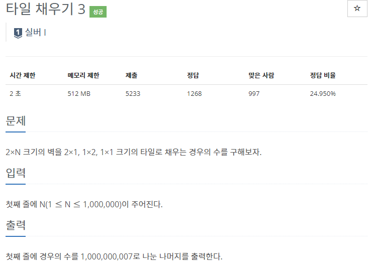
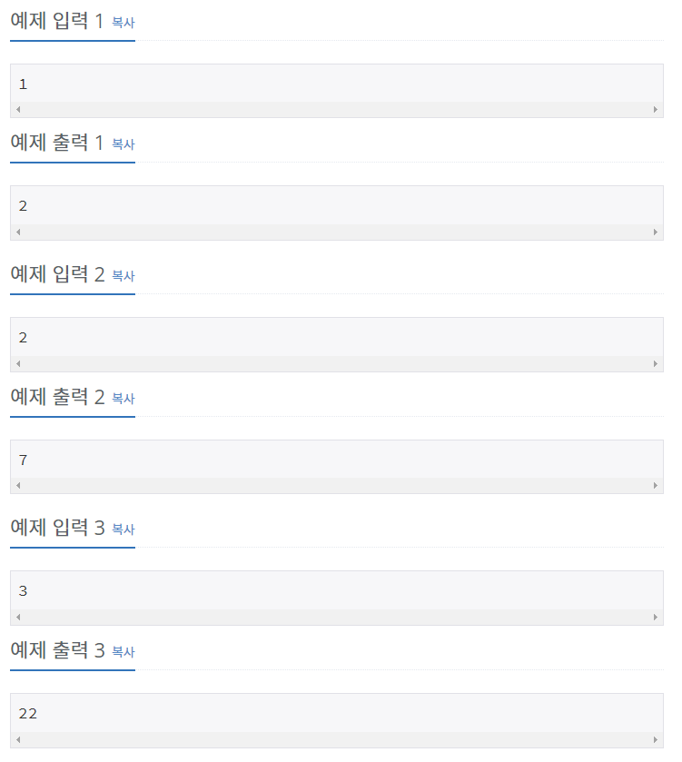
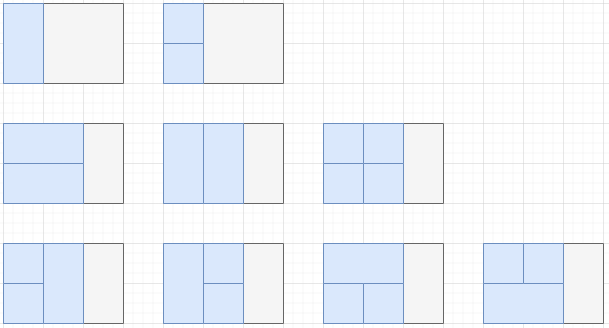
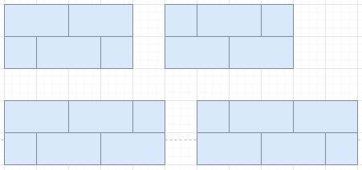

# [[14852] 타일 채우기 3](https://www.acmicpc.net/problem/14852)



___
## 🤔접근
___
## 💡풀이
- <B>알고리즘 & 자료구조</B>
    - `DP - Tilling`
- <b>구현</b>
	- `1열과 2열을 채우는 방식`은 아래와 같다.<br>
		
	- `3열 이후 채우는 고유 방식`도 고려해주어야 한다.<br>
		
		- N이 최대 100만이므로, 매 번 중복된 연산으로 더해주는 방식을 버리고, 동적계획법을 이용해야 한다.
			- <b>비효율적인 점화식</b>
				```c++
				for (int i = 3; i <= N; i++) {
					dp[i] = (2 * dp[i - 1 + 3 * dp[i - 2]) % MOD;
					for(int j = i - 3; j >= 0; j--)
						dp[i] = (dp[i] + 2 * dp[j]) % MOD;
				}
				```
			- 따라서, dp를 2차원 배열로 변형하였다.
		- <b>기저 조건:</b>
			- `dp[1][0]` = 2
			- `dp[2][0]` = 7
			- `dp[2][1]` = 1
	- <b>점화식</b>
		```c++
		for (int i = 3; i <= N; i++) {
			dp[i][1] = (dp[i - 1][1] + dp[i - 3][0]) % MOD;
			dp[i][0] = (2 * dp[i - 1][0] + 3 * dp[i - 2][0] + 2 * dp[i][1]) % MOD;
		}
		```
___
## ✍ 피드백
___
## 💻 핵심 코드
```c++
int main() {
    ...

	vector<vector<long long>> dp(N + 1, vector<long long>(2));
	dp[1][0] = 2;
	if (N > 1) {
		dp[2][0] = 7;
		dp[2][1] = 1;
	}

	for (int i = 3; i <= N; i++) {
		dp[i][1] = (dp[i - 1][1] + dp[i - 3][0]) % MOD;
		dp[i][0] = (2 * dp[i - 1][0] + 3 * dp[i - 2][0] + 2 * dp[i][1]) % MOD;
	}

	cout << dp[N][0];

    ...
}
```