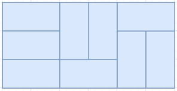
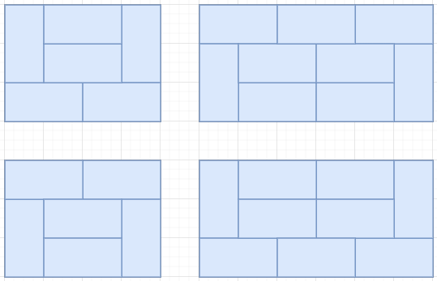

# [[2133] 타일 채우기](https://www.acmicpc.net/problem/2133)


___
## 🤔접근
___
## 💡풀이
- <B>알고리즘 & 자료구조</B>
    - `DP - Tilling`
- <b>구현</b>
	- `2열을 채우는 방식`은 아래와 같이 `3가지 경우의 수`로 나뉜다.<br>
		
		- <b>기저 조건:</b>
			- `dp[0] = 1`
			- `dp[2] = 3`
	- 2 x 1 타일과 1 x 2 타일을 이용하여 3 x N 의 벽을 모두 채우려면, N은 반드시 `짝수`여야만 한다.
	- 또한, `4열, 6열, ... 을 채우는 방식`은 아래와 같이 `각각 2가지 경우의 수`가 고유하게 존재한다.<br>
		
		- 따라서, 이를 모두 더해주어야 한다.
	- <b>점화식</b>
		```c++
		for (int i = 4; i <= N; i += 2) {
			dp[i] += dp[i - 2] * 3;
			for (int j = i - 4; j >= 0; j -= 2)
				dp[i] += dp[j] * 2;
		}
		```
___
## ✍ 피드백
___
## 💻 핵심 코드
```c++
int main() {
    ...

    dp[0] = 1;
	if (N >= 2)
		dp[2] = 3;

	for (int i = 4; i <= N; i += 2) {
		dp[i] += dp[i - 2] * 3;
		for (int j = i - 4; j >= 0; j -= 2)
			dp[i] += dp[j] * 2;
	}

	cout << dp[N];

    ...
}
```