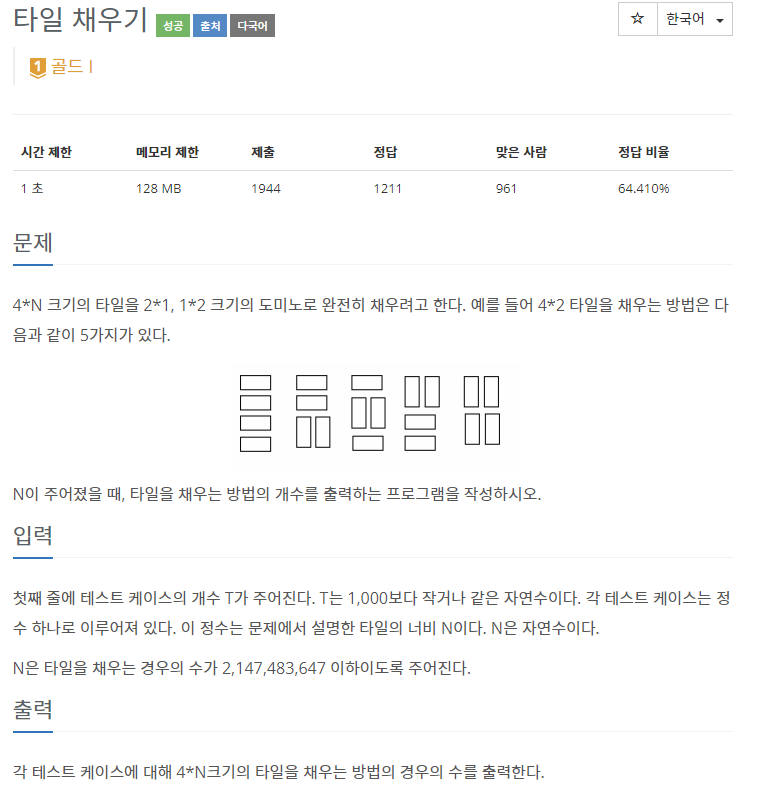
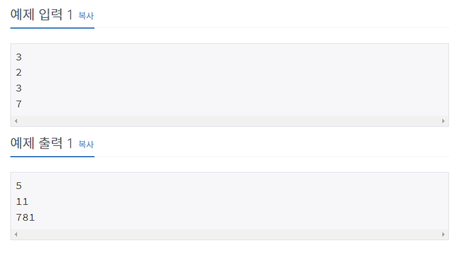
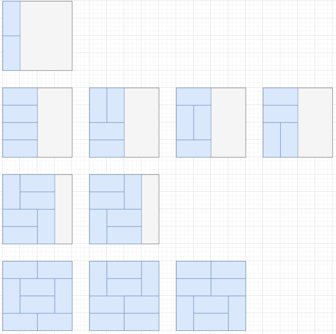

# [[2718] 타일 채우기](https://www.acmicpc.net/problem/2718)



___
## 🤔접근
___
## 💡풀이
- <B>알고리즘 & 자료구조</B>
    - `DP - Tilling`
- <b>구현</b>
	- 1, 2, 3, 4열까지 각 고유한 방식이 아래와 같이 존재한다.<br>
		
		- 1열의 고유 방식을 두 번 사용하는 경우까지 합치면, 2열을 만들 수 있는 방법은 총 5가지이다.
	- <b>기저 조건</b>
		- `dp[0]` = 1
		- `dp[1]` = 1
		- `dp[2]` = 5
	- <b>점화식</b>
		```c++
		for (int i = 3; i <= 30; i++) 
			dp[i] = dp[i - 1] + 4 * dp[i - 2];
		```
		- 또한, 3열부터 `홀수 열과 짝수 열`마다 각각 고유한 방식이 `2개, 3개`씩 추가로 존재하므로, 이 경우의 수도 각각 더해주어야 한다.
			```c++
			for (int i = 3; i <= 30; i++) {
				dp[i] = dp[i - 1] + 4 * dp[i - 2];
				for (int j = 3; j <= i; j++)
					dp[i] += (j % 2 ? 2 * dp[i - j] : 3 * dp[i - j]);
			}
			```
___
## ✍ 피드백
___
## 💻 핵심 코드
```c++
int main() {
	... 

	vector<long long> dp(30 + 1);
	dp[0] = 1;
	dp[1] = 1;
	dp[2] = 5;

	for (int i = 3; i <= 30; i++) {
		dp[i] = dp[i - 1] + 4 * dp[i - 2];
		for (int j = 3; j <= i; j++)
			dp[i] += (j % 2 ? 2 * dp[i - j] : 3 * dp[i - j]);

		if (dp[i] > 2147483647)
			break;
	}

	...
}
```