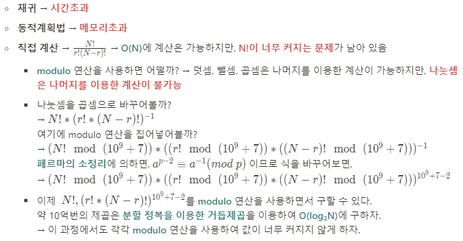

# [[15791] 세진이의 미팅](https://www.acmicpc.net/problem/15791)


___
## 🤔접근

___
## 💡풀이
- <B>알고리즘 & 자료구조</B>
	- `페르마의 소정리`
    - `분할 정복을 이용한 거듭제곱`
- <b>구현</b>
    - 페르마의 소정리를 이용하여, 나눗셈을 곱셈으로 변환하여 나머지를 이용한 계산이 가능해졌다.
        - 팩토리얼 계산과, 거듭제곱 계산 모두 나머지를 이용하여 계산하였다.
___
## ✍ 피드백
___
## 💻 핵심 코드
```c++
long long moduloPow(long long x, long long power) {
	if (power == 0)
		return 1;

	long long res = moduloPow(x, power / 2);
	res = res * res % MOD;

	if (power % 2)
		return res * x % MOD;

	return res;
}

int main() {
	...

	vector<long long> fact(N + 1);
	fact[0] = 1;
	for (int i = 1; i <= N; i++)
		fact[i] = fact[i - 1] * i % MOD;
	
	cout << fact[N] * moduloPow(fact[M] * fact[N - M] % MOD, MOD - 2) % MOD;

	...
}
```