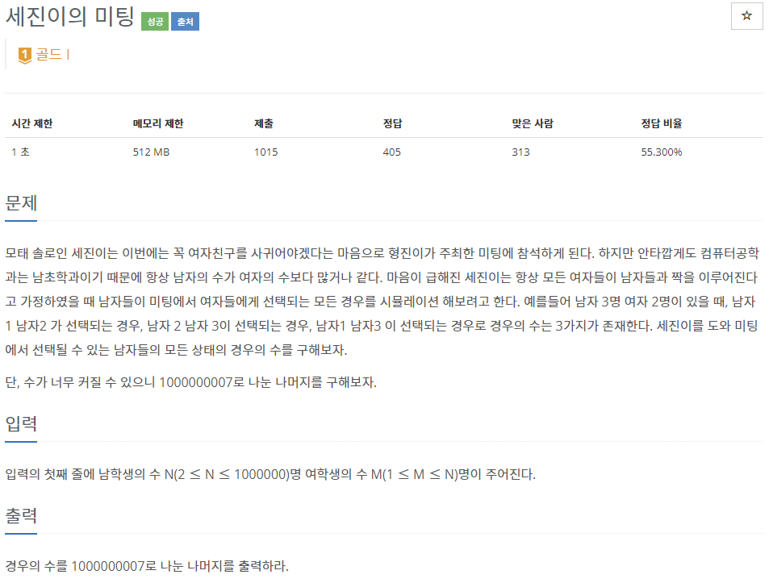
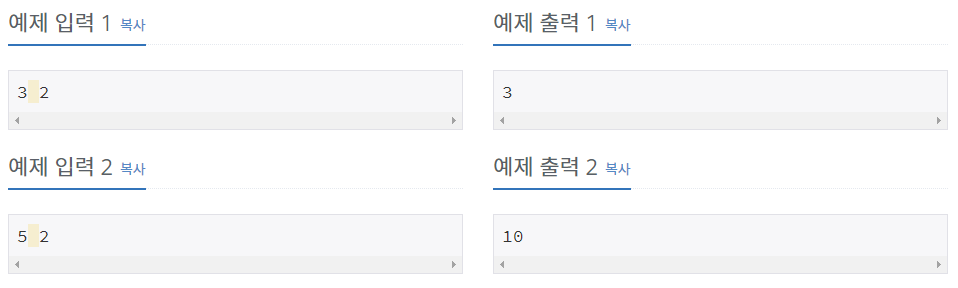

# [[15791] 세진이의 미팅](https://www.acmicpc.net/problem/15791)



___
## 🤔접근
- **재귀** → **시간초과**
- **동적계획법** → **메모리초과**
- **직접 계산** → $\frac{N!}{r!(N-r)!}$ → **O(N)**에 계산은 가능하지만, **N!이 너무 커지는 문제**가 남아 있음
    - **modulo** 연산을 사용하면 어떨까?<br> → 덧셈, 뺄셈, 곱셈은 나머지를 이용한 계산이 가능하지만, **나눗셈은 나머지를 이용한 계산이 불가능**
    - 나눗셈을 곱셈으로 바꾸어볼까?<br> 
    → $N! * (r! * (N - r)!)^{-1}$<br> 
    여기에 modulo 연산을 집어넣어볼까?<br> 
    → $(N! \mod\ (10^9+7))* ((r!\mod\ (10^9+7)) * ((N - r)!\mod\ (10^9+7)))^{-1}$<br>
    **페르마의 소정리**에 의하면, $a^{p-2}\equiv a^{-1} (mod\ p)$ 이므로 식을 바꾸어보면,<br>
    → $(N! \mod\ (10^9+7))* ((r!\mod\ (10^9+7)) * ((N - r)!\mod\ (10^9+7)))^{10^9+7-2}$
    - 이제  $N!, (r! * (N - r)!)^{10^9+7-2}$를 **modulo** 연산을 사용하면서 구할 수 있다.
    약 10억번의 제곱은 **분할 정복을 이용한 거듭제곱**을 이용하여 **O(log₂N)**에 구하자.<br>
    → 이 과정에서도 각각 **modulo** 연산을 사용하여 값이 너무 커지지 않게 하자.
___
## 💡풀이
- <B>알고리즘 & 자료구조</B>
	- `페르마의 소정리`
    - `분할 정복을 이용한 거듭제곱`
- <b>구현</b>
    - 페르마의 소정리를 이용하여, 나눗셈을 곱셈으로 변환하여 나머지를 이용한 계산이 가능해졌다.
        - 팩토리얼 계산과, 거듭제곱 계산 모두 나머지를 이용하여 계산하였다.
___
## ✍ 피드백
___
## 💻 핵심 코드
```c++
long long moduloPow(long long x, long long power) {
	if (power == 0)
		return 1;

	long long res = moduloPow(x, power / 2);
	res = res * res % MOD;

	if (power % 2)
		return res * x % MOD;

	return res;
}

int main() {
	...

	vector<long long> fact(N + 1);
	fact[0] = 1;
	for (int i = 1; i <= N; i++)
		fact[i] = fact[i - 1] * i % MOD;
	
	cout << fact[N] * moduloPow(fact[M] * fact[N - M] % MOD, MOD - 2) % MOD;

	...
}
```