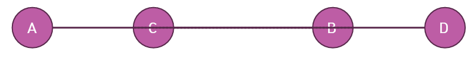

# CCW 알고리즘과 선분 교차 판별

## CCW 알고리즘
- CCW는 `CounterClockWise`의 약자로, `반시계방향`을 의미한다.
- CCW 알고리즘은 평면 위에 놓여진 `세 점의 방향관계`를 구할 수 있다.

### 2차원 평면 위의 세 점 방향성 판별하기
- 평면 위의 점 A, B, C를 순서대로 보았을 때, 
    1. `반시계방향`으로 놓여져 있으면 `양수`를 반환한다.
    2. `시계방향`으로 놓여져 있으면 `음수`를 반환한다.
    3. `평행`으로 놓여져 있으면 `0`을 반환한다.
- 세 점으로부터 다음과 같이 두 개의 벡터 a, b를 얻을 수 있다.
    - 
    - 이 때, 벡터 a와 벡터 b를 `외적`한 결과의 방향으로 세 점 A, B, C의 방향을 판단할 수 있다.
- **세 점의 방향성 판별하는 방법**
    - 세 점 A, B, C를 다음과 같이 정의한다.
        - A = (x₁, y₁, 0)
        - B = (x₂, y₂, 0)
        - C = (x₃, y₃, 0)
    - 두 벡터 a, b를 다음과 같이 정의한다.
        - 벡터 a = 벡터 AB = (x₂ - x₁, y₂ - y₁, 0)
        - 벡터 b = 벡터 AC = (x₃ - x₁, y₃ - y₁, 0)
    - 두 벡터의 외적 결과
        - 벡터 a × 벡터 b = (0, 0, (x₂ - x₁)(y₃ - y₁) -(x₃ - x₁)(y₂ - y₁))
    - **방향성 판별**
        - `D = (x₂ - x₁)(y₃ - y₁) - (x₃ - x₁)(y₂ - y₁)`
            - D > 0 : 반시계방향
            - D = 0 : 평행
            - D < 0 : 시계방향
```c++
long long CCW(const Point& A, const Point& B, const Point& C) {
    // 세 점(x, y, 0)을 외적한 결과(2차원)
	const long long external_product = (B.x - A.x) * (C.y - A.y) - (C.x - A.x) * (B.y - A.y);

    // overflow 방지를 위해 값을 최소로 하여 반환
	if (external_product > 0)
		return 1;
	else if (external_product == 0)
		return 0;
	else if (external_product < 0)
		return -1;
}
```

### 2차원 평면위의 두 선분의 교차여부 판별하기
- 두 선분이 평행하지 않은 경우
    1. 두 선분이 교차
        - 
    2. 두 선분이 교차하지 않음
        - 
    - **교차여부 판별방법**
        - 각 선분에 대한 다른 선분의 각 점의 방향성을 각각 구한 뒤, 서로의 방향성이 다른지 검사한다.
            > CCW(A, B, C) * CCW(A, B, D) <= 0 && CCW(C, D, A) * CCW(C, D, B) <= 0
- 두 선분이 평행한 경우
    1. 두 선분이 교차
        - 
    2. 두 선분이 교차하지 않음
        - 
    - **교차여부 판별방법**
        - 먼저, 각 선분에 대한 다른 선분의 각 점의 방향성이 0인지 검사한다.
        - 다음으로, B에 대한 C의 상대 위치와 D에 대한 A의 상대 위치를 비교한다.
            > CCW(A, B, C) * CCW(A, B, D) == 0 && CCW(C, D, A) * CCW(C, D, B) == 0<br>
            > C <= B && A <= D
```c++
bool isIntersect(const Line& A, const Line& B) {
	const int case1 = CCW(A.start, A.end, B.start) * CCW(A.start, A.end, B.end);
	const int case2 = CCW(B.start, B.end, A.start) * CCW(B.start, B.end, A.end);

    // 두 선분이 평행인지?
	if (case1 == 0 && case2 == 0) {
		pair<int, int> p1 = make_pair(A.start.x, A.start.y);
		pair<int, int> p2 = make_pair(A.end.x, A.end.y);
		pair<int, int> p3 = make_pair(B.start.x, B.start.y);
		pair<int, int> p4 = make_pair(B.end.x, B.end.y);

        // 일반화를 위한 순서 조정
		if (p1 > p2)
			swap(p1, p2);
		if (p3 > p4)
			swap(p3, p4);

		return p1 <= p4 && p3 <= p2;
	}

    // 두 선분이 교차하였는지?
	return case1 <= 0 && case2 <= 0;
}
```
