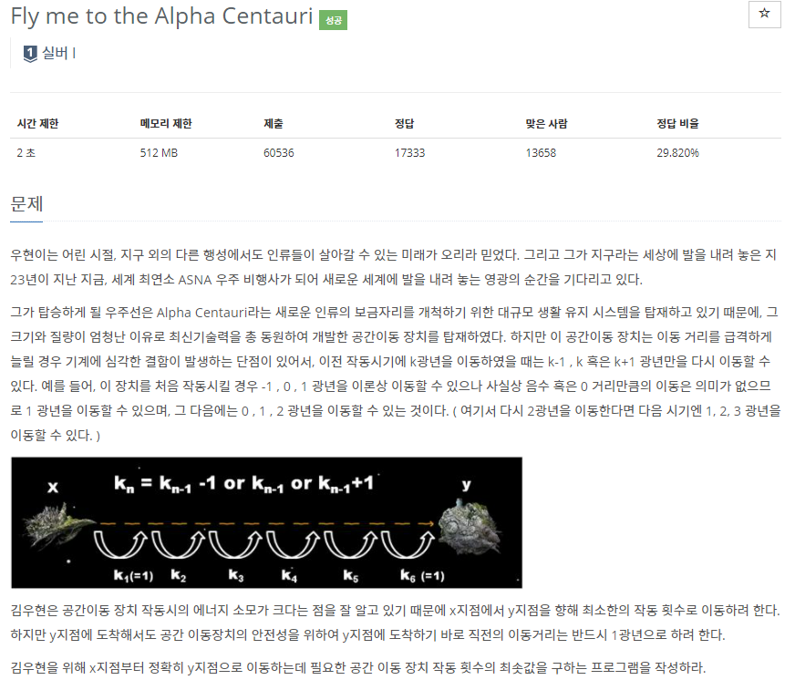
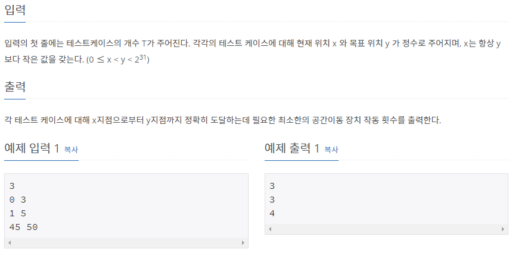

# [[1011] Fly me to the Alpha Centauri](https://www.acmicpc.net/problem/1011)



___
## 🤔접근
___
## 💡풀이
- <b>탐욕(Greedy) 알고리즘</b>을(를) 사용하였다.
	- 두 지점간의 차이(dist)만큼 이동해야 한다.
	- k광년을 이동하면 k-1, k, k+1 광년만큼 이동이 가능하다.
		- 가장 최소로 이동 장치를 작동하려면, 결국 `1 2 ... N-1 N N-1 ... 2 1` 이와 같이 이동해야 한다.
___
## ✍ 피드백
___
## 💻 핵심 코드
```c++
int main(){
	...
	for (int i = 0; i < N; i++) {
		long long dist = v[i].second - v[i].first; // 두 지점 거리 차
		int ans = 0;

		long long n = 1;
		long long cur = 0;
		while (true) {
			if (cur + 2 * n <= dist) { // N을 제외한 양 끝(1, 2, ... N-1)
				cur += 2 * n++;
				ans += 2;
			}
			else if (cur + n <= dist) { // N
				cur += n;
				ans++;
			}
			else
				break;
		}
		dist -= cur;

		while (dist) { // 1 2 .. N-1 N N N N-1 ... 2 1 방지
			if (dist < n)
				n--;
			else {
				dist -= n;
				ans++;
			}
		}

		cout << ans << '\n';
	}
	...
}
```