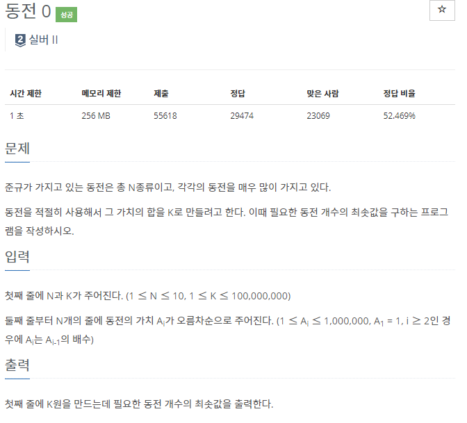
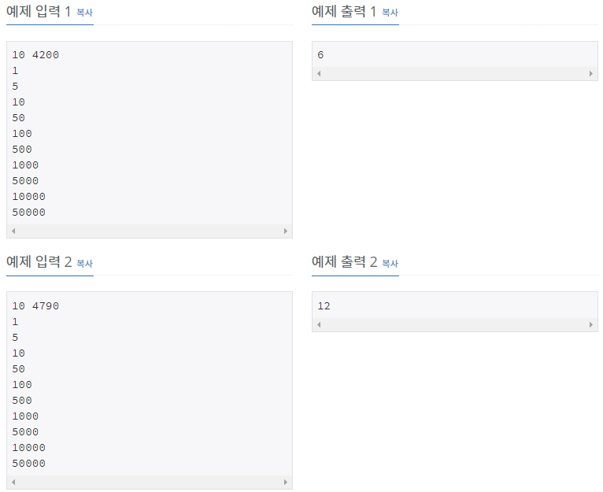

# [[11047] 동전 0](https://www.acmicpc.net/problem/11047)



___
## 🤔접근
___
## 💡풀이
- <b>탐욕(Greedy) 알고리즘</b>을(를) 사용하였다.
	- 큰 동전부터 작은 동전 순서로 먼저 사용하면 최소의 동전을 사용해서 그 합을 K로 만들 수 있다.
___
## ✍ 피드백
___
## 💻 핵심 코드
```c++
int main(){
	...
	sort(coin.begin(), coin.end(), less<int>());

	int ans = 0;
	int cur = 0;
	int idx = coin.size() - 1;

	while (cur != K) {
		if (coin[idx] > K - cur)
			idx--;
		else {
			cur += coin[idx];
			ans++;
		}
	}

	cout << ans;
	...
}
```