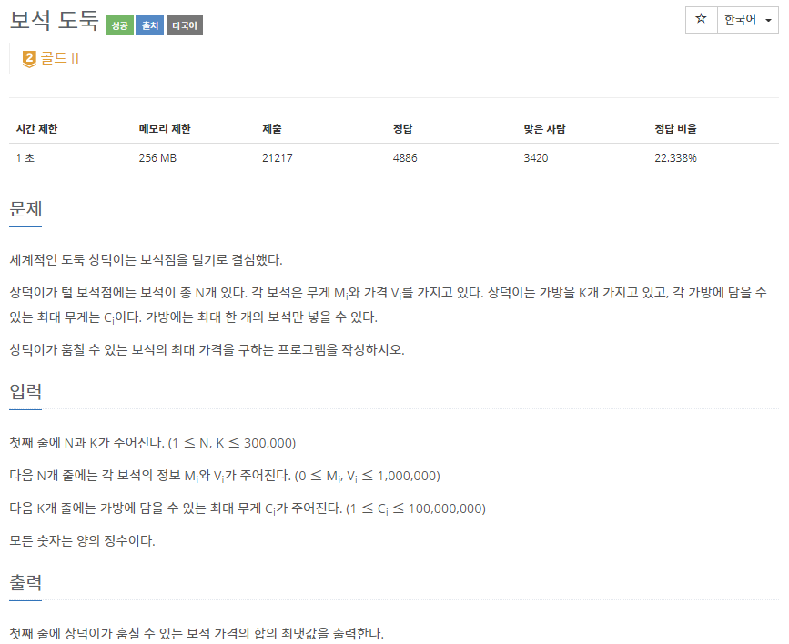
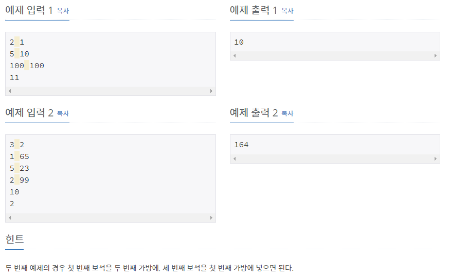

# [[1202] 보석 도둑](https://www.acmicpc.net/problem/1202)



___
## 🤔접근
1. <b>K개의 가방마다 N개의 보석 중 C보다 무게가 같거나 낮고 가장 비싼 보석을 담아야 한다.</b>
	- K번의 반복문에서 N개의 보석을 매번 탐색하는 것은 TLE(30만²)
2. <b>어찌됐든, K개의 가방을 모두 처리해야하므로, O(K)는 필수로 잡고 가야 한다.</b>
	- 각 가방에서 답을 찾기 위해 `O(logN) 이하`의 방법을 찾아야 한다.
	- 이분탐색은 도움이 될 것 같지 않다, 그렇다면 탐욕스러운 방법으로 해결할 수 있을까?
___
## 💡풀이
- <b>탐욕(Greedy) 알고리즘, 우선순위 큐(Priority Queue) 자료구조</b>을(를) 사용하였다.
	- 보석을 무게 -> 가격 순서로 오름차순으로 정렬하고, 가방을 무게 오름차순으로 정렬하자.
	- 가장 가벼운 무게의 가방부터 가장 무거운 무게의 가방까지 아래와 같이 탐색하자.
		- 가장 가벼운 보석부터 가방의 최대 무게를 넘지 않는 모든 보석의 가격을 우선순위 큐에 삽입하자.
		- 위의 작업이 끝나면, 우선순위 큐에는 가방의 최대 무게를 넘지 않는 가장 비싼 보석의 가격이 들어 있게 된다.
		- 우선순위 큐 top의 값을 ans에 더하고, pop을 한 번 하자.
___
## ✍ 피드백
1. <b>우선순위 큐와 탐욕 알고리즘을 이용해야 한다는 생각까지는 미쳤지만...</b>
	- 보석을 가격, 무게 내림차순으로 우선순위 큐에서 정렬하고, 가방은 무게 오름차순으로 정렬하였다.
	- 첫 번째 보석부터 마지막 보석까지 탐색하면서, 무게가 가방의 최대 무게보다 작거나 같으면 ans에 추가하고 다음 가방을 탐색하는 식으로 구현하였다.
	- 만약, 매 탐색마다 가장 마지막 보석만이 가방의 최대 무게보다 작거나 같으면, 결국 시간 복잡도는 O(NK)가 되어 TLE를 피할 수 없었다.
2. <b>다른 관점에서 생각하는 연습을 하자!</b>
	- 가격이 가장 비싼 보석을 찾아야 한다는 강박관념에 사로잡혀, 가격 내림차순으로 정렬해야 한다는 생각에만 매진했었다.
	- 하지만 그 반대로, 가격, 무게를 오름차순으로 정렬하고, 가방을 무게 오름차순으로 탐색하면서, 가방의 최대 무게를 넘지 않을 때까지 우선순위 큐에 보석의 가격을 삽입하는 방식으로 매 순간 가장 최적의 해를 구할 수 있었다.
3. <b>핵심 포인트</b>
	- 가방의 최대 무게를 넘지 않으면서
		- 가방과 보석을 무게 오름차순으로 정렬하고, 가방의 최대 무게를 넘지 않을때 까지 보석을 탐색.
	- 가장 비싼 보석을 찾아라
		- 위에서 탐색한 보석들 중 가장 비싼 값을 구하기 위해, 우선순위 큐에 각 보석을 삽입.
		- 가장 비싼 값의 보석을 가방에 담고, 나머지 탐색한 보석들도 이후에 가장 비싼 값으로 여겨질 수 있으므로 데이터를 유지해야 한다.
		- O(1)에 가장 큰 값을 알 수도 있고, 항상 정렬된 상태를 O(logN)에 유지하여 데이터를 보관하는 우선순위 큐에 보석들의 가격을 담자.
___
## 💻 핵심 코드
```c++
int main(){
	...

	sort(bag.begin(), bag.end());
	sort(jewelry.begin(), jewelry.end());

	long long ans = 0;
	int idx = 0;
	for (int i = 0; i < K; i++) { 
		int limitWeight = bag[i];

		while (idx < N && jewelry[idx].first <= limitWeight) 
			pq.push(jewelry[idx++].second);

		if (!pq.empty()) {
			ans += pq.top();
			pq.pop();
		}
	}

	...
}
```