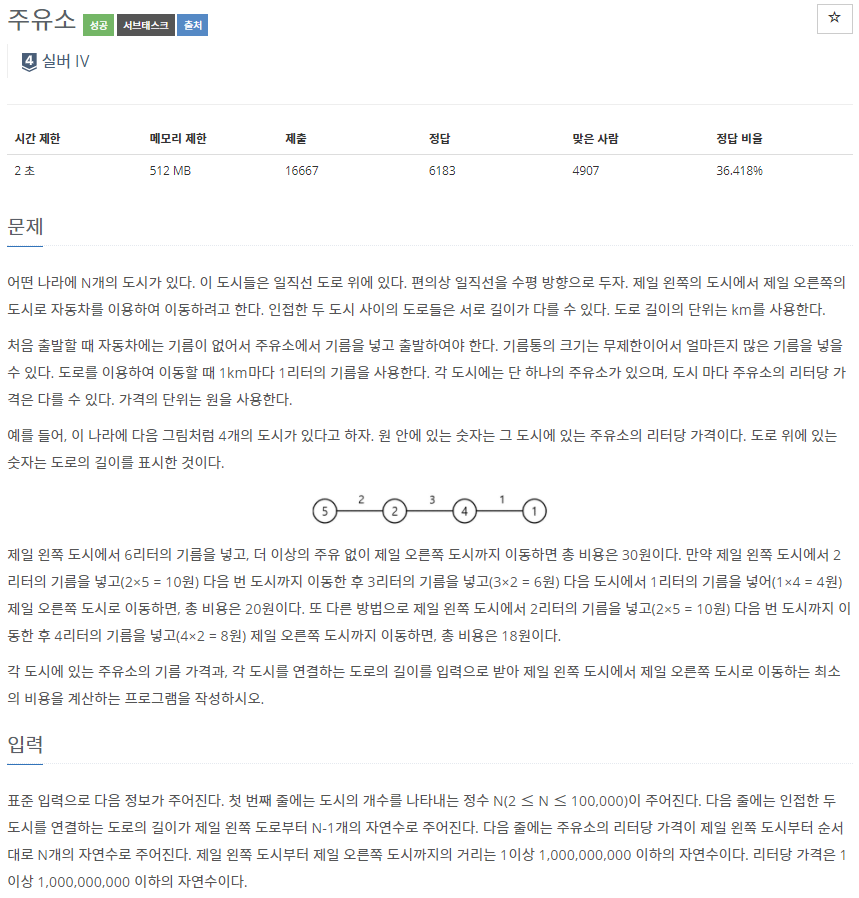
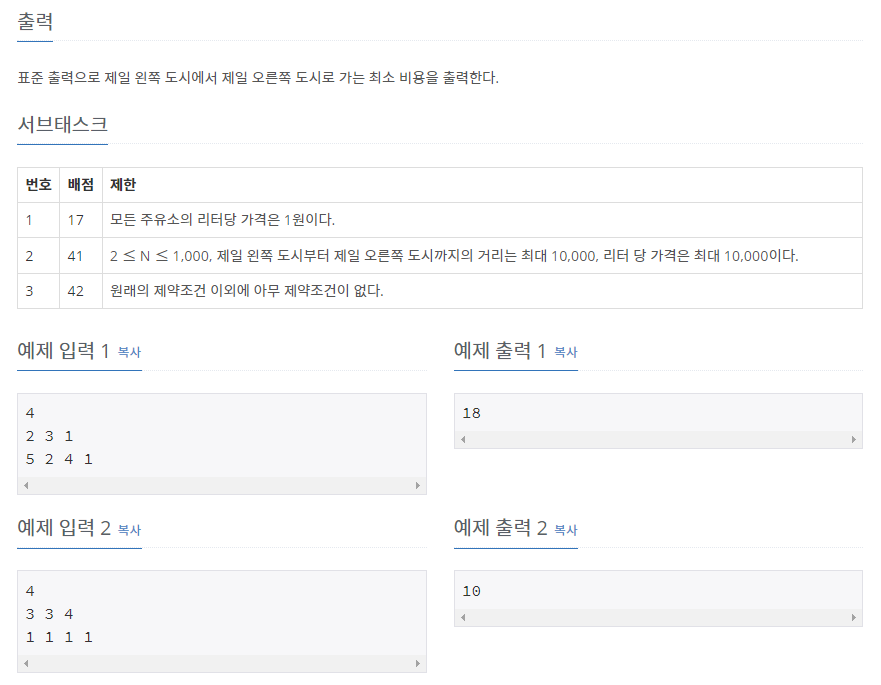

# [[13305] 주유소](https://www.acmicpc.net/problem/13305)



___
## 🤔접근
___
## 💡풀이
- <b>탐욕(Greedy) 알고리즘</b>을(를) 사용하였다.
	- 먼저 현재 위치의 도시 A보다 기름 비용이 더 싼 도시 B를 찾는다.
		- 위의 과정 중간에는 기름 비용이 비싼 도시들이 위치하게 될 것이므로, 도시 A부터 도시 B까지의 총 거리만큼 현재 위치에서 기름을 구입하고, 이동하면 최소의 비용으로 이동할 수 있다.
___
## ✍ 피드백
___
## 💻 핵심 코드
```c++
int main(){
	...
	int idx = 0;
	long long cnt, cur;
	long long ans = 0;
	while (idx + 1 < N) {
		cur = cost[idx];
		cnt = km[++idx];
		while (idx + 1 < N && cur <= cost[idx]) 
			cnt += km[++idx];
		ans += cur * cnt;
	}

	cout << ans;
	...
}
```