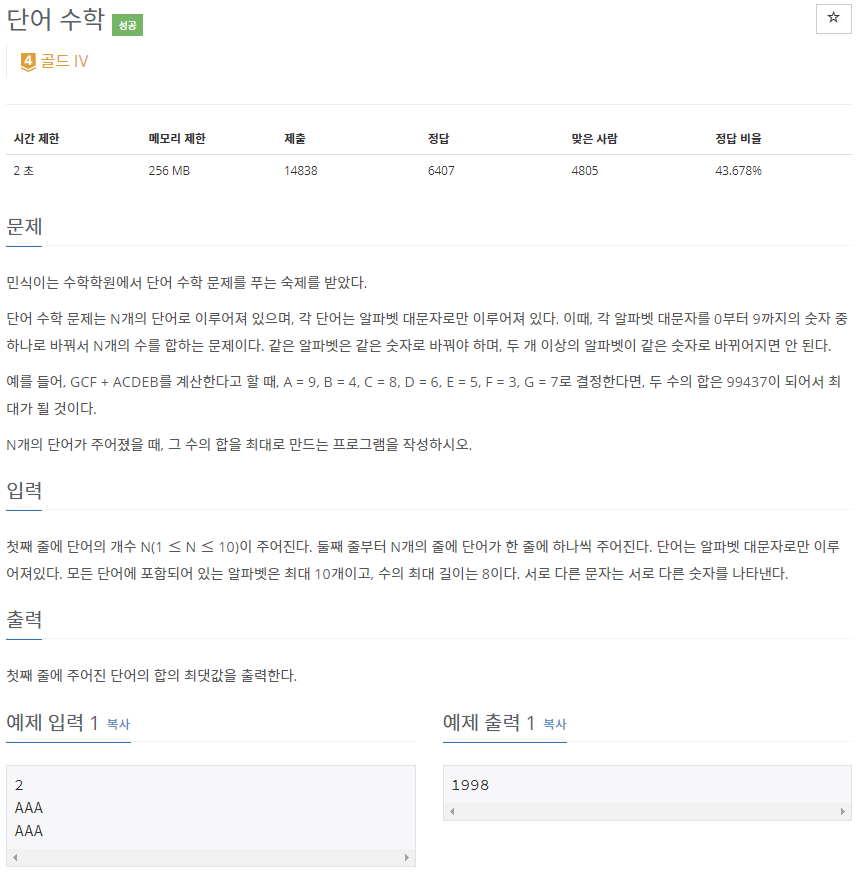
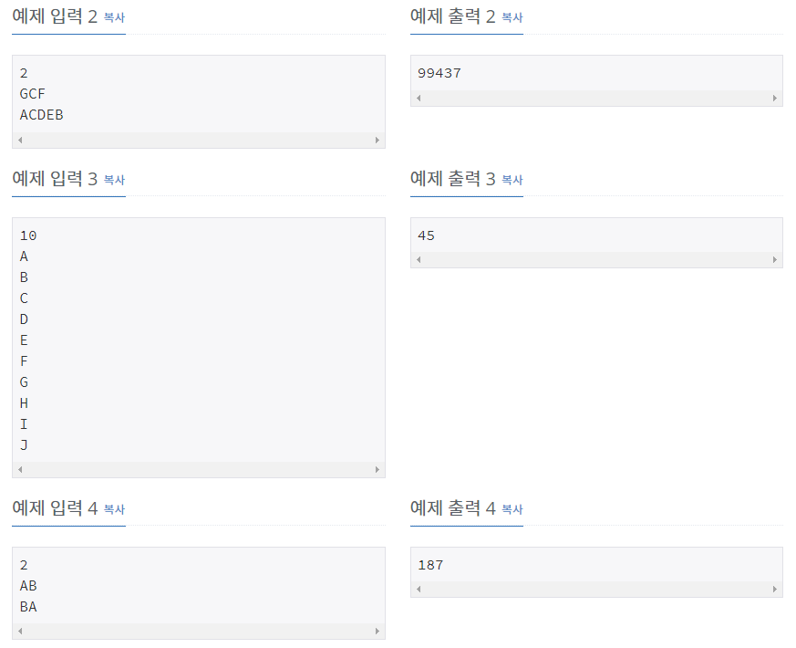

# [[1339] 단어 수학](https://www.acmicpc.net/problem/1339)



___
## 🤔접근
___
## 💡풀이
- <b>탐욕(Greedy) 알고리즘</b>을(를) 사용하였다.
	- 방정식을 세우듯이 식을 만들어보자.
		> ex) ABC + BCD
		> - 110B + 100A + 11C + D
		> - 계수가 큰 순서대로 9, 8, ... 1을 각각 대입하여 더해주면 된다.
___
## ✍ 피드백
___
## 💻 핵심 코드
```c++
int main(){
	...
	vector<int> alphabet(26);
	for (int i = 0; i < N; i++) 
		for (int j = word[i].size() - 1, d = 1; j >= 0; j--, d *= 10) 
			alphabet[word[i][j] - 'A'] += d;
	sort(alphabet.begin(), alphabet.end(), greater<int>());
	
	int ans = 0;
	int num = 9;
	int idx = 0;
	while (alphabet[idx] != 0) 
		ans += alphabet[idx++] * num--;	

	cout << ans;
	...
}
```