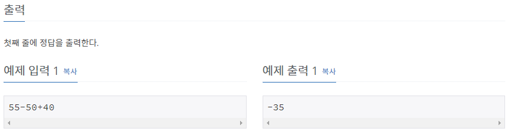

# [[1541] 잃어버린 괄호](https://www.acmicpc.net/problem/1541)



___
## 🤔접근
___
## 💡풀이
- <b>탐욕(Greedy) 알고리즘</b>을(를) 사용하였다.
	- 왼쪽부터 `-` 연산자가 나오기 전까지, `+` 연산을 모두 수행하여 하나의 값으로 만든다.
		- `-` 연산자가 나오면, 우측도 위와 동일하게 `+` 연산을 모두 수행하여 하나의 값으로 만든 후, `-` 부호를 붙여 왼쪽의 값과 합친다.
		- 이와 같이 연산을 수행하면 항상 최소의 값을 얻을 수 있다.
	- 매 `-` 연산자 마다, `-` 연산자 왼쪽의 값들을 더하여 벡터에 하나씩 추가한다.
		- 최종적으로, 각 값들을 `-` 연산을 수행함으로써 위의 아이디어를 코드로 구현할 수 있다.
___
## ✍ 피드백
___
## 💻 핵심 코드
```c++
int main(){
	...
	stack<int> s;
	vector<int> num(1, 0);

	for (int i = 0; i < arithmeticExpression.size(); i++) {
		if (arithmeticExpression[i] != '-' && arithmeticExpression[i] != '+')
			s.push(arithmeticExpression[i] - '0');
		else {
			int n = 1;
			while (!s.empty()) {
				num.back() += s.top() * n;
				n *= 10;
				s.pop();
			}

			if (arithmeticExpression[i] == '-')
				num.push_back(0);
		}
	}
	int n = 1;
	while (!s.empty()) {
		num.back() += s.top() * n;
		n *= 10;
		s.pop();
	}

	int sum = num[0];
	for (int i = 1; i < num.size(); i++)
		sum -= num[i];
	cout << sum;
	...
}
```