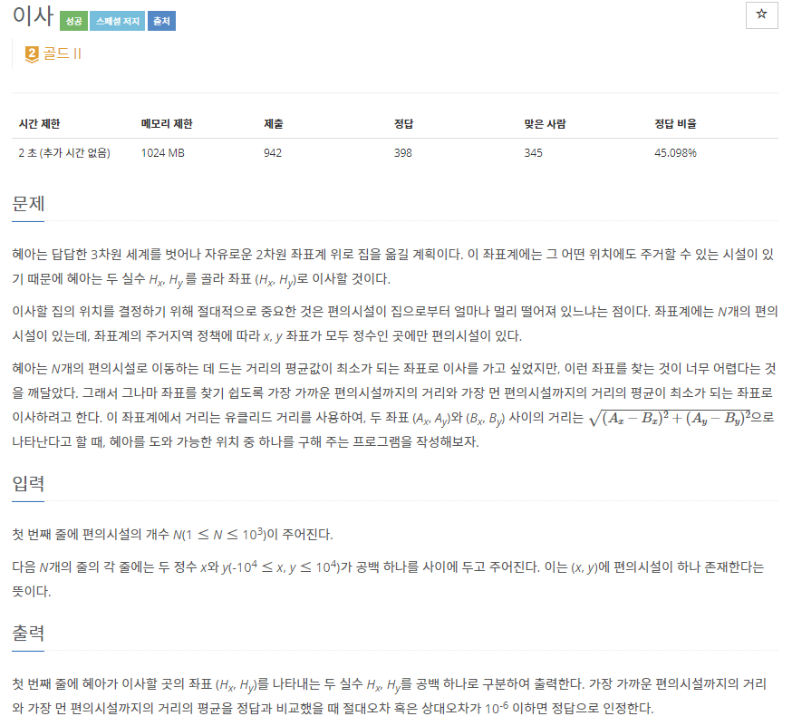
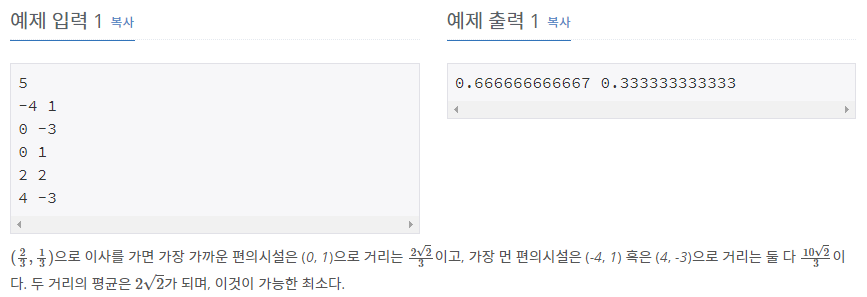

# [[17371] 이사](https://www.acmicpc.net/problem/17371)



___
## 🤔접근
___
## 💡풀이
- <b>탐욕(Greedy) 알고리즘</b>을(를) 사용하였다.
	- 편의점 위로 집을 옮기면 최소 거리는 항상 0이므로, 이제 최대 거리가 가장 먼 편의점 위치를 찾자.
		- 각 편의점으로 집을 옮겨보면서 최적의 해를 구하자.
		- 거리를 계산할 때, 루트는 생략해도 크기 비교를 하는 데 문제가 없다.
___
## ✍ 피드백
___
## 💻 핵심 코드
```c++
int len(int x1, int x2, int y1, int y2) {
	return pow(x1 - x2, 2) + pow(y1 - y2, 2);
}

int main(){
	...
	int minVal = INT_MAX;
	int minIdx = 0;
	for (int i = 0; i < N; i++) {
		int maxVal = 0;
		for (int j = 0; j < N; j++) {
			if (i == j)
				continue;

			maxVal = max(maxVal, len(pos[i].first, pos[j].first, pos[i].second, pos[j].second));
		}

		if (minVal > maxVal) {
			minVal = maxVal;
			minIdx = i;
		}
	}

	cout << pos[minIdx].first << ' ' << pos[minIdx].second;
	...
}
```